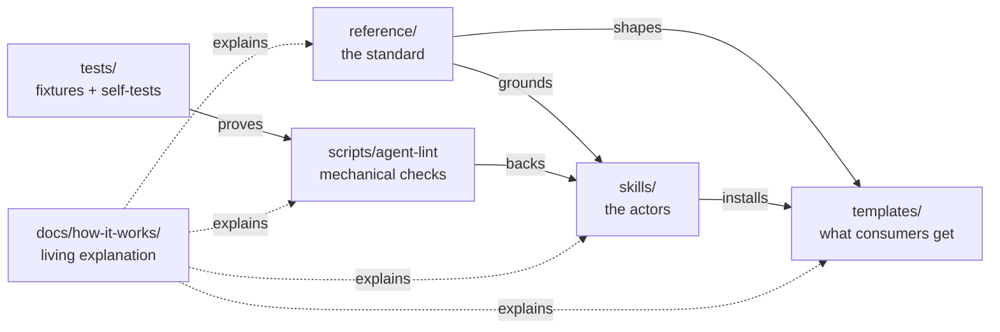
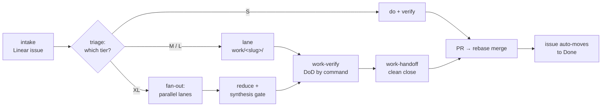
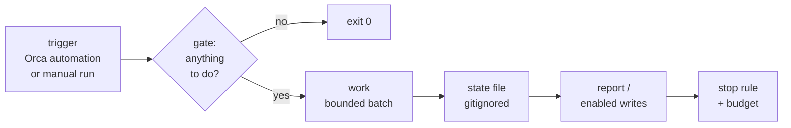

# Agent-Engineering

The agent-engineering standard: one repo that defines, installs, and audits
how AI-agent work happens across all of my repositories — six layers,
runtime-neutral, model-agnostic.

| Layer | Question it answers |
|---|---|
| Context | what does the model see right now? |
| Memory | what survives between sessions? |
| Harness | what surrounds one run — tools, state, permissions, verification? |
| Loop | how does work repeat itself with feedback and a stop rule? |
| Graph | how do many loops coordinate — lanes, gates, reducers? |
| Cross-cutting | reducers between fan-out and synthesis; MCP as the tool standard |

## Architecture

Each directory answers exactly one question:

| Directory | Question | Status |
|---|---|---|
| `reference/` | what is the standard, and why? | live, all layers |
| `templates/repo/` | what gets installed in a consuming repo? | live |
| `skills/` | how does it replicate and get used day to day? | all six live |
| `scripts/` | what is checked mechanically, without judgment? | live |
| `global/` | what belongs in the global (`~/.claude`) layer? | live |
| `tests/` | how is the standard itself tested? | live |
| `docs/` | why did we decide this, and how does it all work? | live |

The arrows are dependencies of meaning: skills argue from the reference
docs, templates embody them, the lint automates the part of the argument
that needs no judgment, and the fixtures prove the lint tells the truth:

The repo is its own first consumer: the root `AGENTS.md` carries the same
stamp, obeys the same budgets, and passes the same audit it prescribes.

**Deep dive → [docs/how-it-works/architecture.md](docs/how-it-works/architecture.md)**

## How work flows

Every unit of work runs the same lifecycle: intake on the tracker, triage
into a tier, execution under that tier's ceremony, verification by command
— never by confidence — and a clean handoff that ends in a rebase-merged
PR. With the Linear↔GitHub integration active, the merge itself moves the
issue to Done — repo truth drives tracker state, not the other way around.

Tiers are structural, never size-based, and the ratchet is one-way — work
only moves up:

| Tier | You are here when… | Ceremony |
|---|---|---|
| **S** | one step, obvious verification | do it, verify, done |
| **M** | it needs a plan and fits one focused effort | lane + PLAN + PROGRESS |
| **L** | it outlives sessions and needs multiple gates | four files + feature list |
| **XL** | a correct plan forces ≥2 independent parallel lanes | everything L per lane + mandatory fan-out + synthesis gate |

When in doubt, take the higher tier. Consumers receive this table as
`docs/tiers.md` in their own repo.

**Deep dive → [docs/how-it-works/work-lifecycle.md](docs/how-it-works/work-lifecycle.md)** · tiers: [reference/task-tiers.md](reference/task-tiers.md)

## The six skills

Skills are plain markdown procedures — runtimes with native skill support
load them by trigger, and any other agent can simply be told to read the
file and follow it. Each ships with ≥3 evals, written before the skill.

| Skill | Fires when |
|---|---|
| [`agent-init`](skills/agent-init/SKILL.md) | installing the standard in a repo, or migrating a legacy setup |
| [`agent-audit`](skills/agent-audit/SKILL.md) | measuring a repo against the standard (report-only by default) |
| [`work-verify`](skills/work-verify/SKILL.md) | before any "done" — tiered definition of done, evidence by command |
| [`work-handoff`](skills/work-handoff/SKILL.md) | closing or pausing work — clean state, card + tracker sync |
| [`loop-setup`](skills/loop-setup/SKILL.md) | a recurring task passes the loop filter — standing automation |
| [`fan-out`](skills/fan-out/SKILL.md) | XL work — frozen anchors, worker table, reducer contract |

**Deep dive → [docs/how-it-works/standard-lifecycle.md](docs/how-it-works/standard-lifecycle.md)**

## Loops and graphs

A loop is standing automation as a file: five elements, no exceptions —
if one is missing, it is not a loop yet.

Graphs coordinate many lanes at once: isolated git worktrees per worker,
frozen anchors nobody may edit, a deterministic reducer at the join, and a
synthesis gate that runs on the merged whole — per-lane green never
substitutes for it.

Execution is **Orca-first** ([ADR-001](docs/adrs/ADR-001-orca-is-the-executor.md)):
the probe `orca status --json` is step 0 of every executing skill, and
scheduling, managed worktrees, cards, and tracker writes all run through
one command path. Without Orca the no-Orca contract applies — everything
that is a file still happens at full quality; Orca-only steps are declared
NOT done, never faked. Artifacts stay runner-neutral either way: the
portability proof ran a non-Claude runner through a full lane from the
files alone.

**Deep dive → [docs/how-it-works/execution.md](docs/how-it-works/execution.md)** · [reference/orca.md](reference/orca.md) · [reference/tracker.md](reference/tracker.md)

## Adopting the standard

In the target repo, run the `agent-init` skill (or point any agent at
[skills/agent-init/SKILL.md](skills/agent-init/SKILL.md)):

1. It explores first and asks only what it cannot infer — the repo profile
   (once) and the real gotchas.
2. Every command is verified by running it before it enters `AGENTS.md`;
   failures never go in.
3. Existing setups get a migration plan and a hard approval stop before
   anything is touched — content moves, never disappears.
4. You end with a stamped `AGENTS.md` ≤60 lines (verified commands, real
   gotchas, hard constraints, tier one-liner), a pointer `CLAUDE.md`, and a
   `docs/` seed (`tiers.md`, `adrs/`, `specs/`) — nothing speculative.
   `agent-audit` runs as the final gate.

## The standard in one paragraph

A consuming repo carries a canonical `AGENTS.md` of ≤60 lines (what the repo
is, verified commands, real gotchas, genuine hard constraints, a version
stamp) plus a pointer `CLAUDE.md`, and a `docs/` tree of decision records
and rich-reference specs. Work above trivial size runs under explicit
ceremony scaled by tier (S/M/L/XL): definition of done written first, one
lane of work in progress at a time, verification by command — never by
confidence — and clean-state handoffs. Everything an agent needs lives in
files, so any model or runtime can pick up any lane.

## Status

**AE/2.5 — all phases (P0-P5) shipped; the repo is in maintenance.**
Versions bump when templates or checks change
([CHANGELOG.md](CHANGELOG.md)). Since the ladder closed, two decisions
extended the standard: Orca-first execution
([ADR-001](docs/adrs/ADR-001-orca-is-the-executor.md)) and tier XL
([ADR-002](docs/adrs/ADR-002-tier-xl.md)). The full flow is proven live:
Linear intake → triaged tier → Orca worker on a linked worktree → PR →
rebase merge → issue auto-moved to Done by the workspace GitHub app. The
ladder, every fixed decision, and acceptance criteria live in
[docs/specs/SPEC-agent-engineering.md](docs/specs/SPEC-agent-engineering.md).

## License

MIT — see [`LICENSE`](LICENSE).
