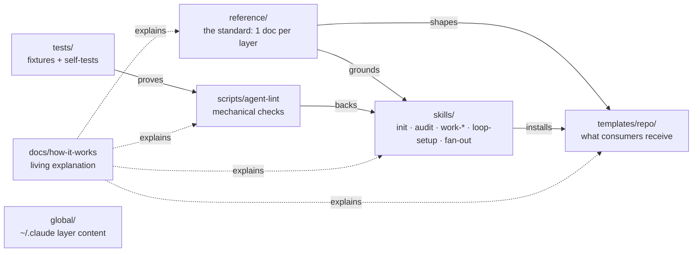
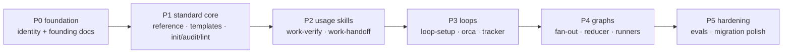

# Architecture

One repo, five verbs. Agent-Engineering **defines** the standard
(`reference/`), **installs** it in consuming repos (`templates/`),
**replicates and applies** it day to day (`skills/`), **enforces** its
mechanical subset (`scripts/`), and **explains** itself (`docs/`). Everything
else — fixtures, global-layer content — exists to keep those five honest.

The repo is also its own first consumer: the root `AGENTS.md` carries the
same version stamp, obeys the same budgets, and must pass the same audit it
prescribes for every other repo. That dogfooding gate is deliberate. A
standard that its own source repo cannot live under is a standard that will
not survive contact with real work.

## The map

Read the arrows as dependencies of meaning: skills argue from the reference
docs, templates embody them, the lint automates the part of the argument
that needs no judgment, and the fixtures prove the lint tells the truth.
`docs/how-it-works/` sits outside the flow and explains all of it — which is
why every structural change must touch it too.

## What each directory answers

### `reference/` — what is the standard, and why?

Live and complete: every layer of the standard has its document.

One document per layer — context, memory, harness, verification, task
tiers, loops, graphs-and-reducers — plus cross-cutting docs (principles,
orca, tracker, runners, design-md, skill authoring). Each file is a distillation, not a mirror: ≤120 lines, a
source-and-date header citing the public material it condenses, and only the
claims we are prepared to enforce. When new guidance appears in the world,
it enters the repo here first; templates and checks follow only if the
guidance changes what we install or verify.

### `templates/repo/` — what gets installed in a consuming repo?

Live since AE/2.0.

The only directory whose content ever leaves this repo. It holds the
canonical `AGENTS.md` skeleton (with `{{PLACEHOLDER}}` markers instantiated
by `ae-init`, never copied verbatim), the one-line pointer `CLAUDE.md`,
the `docs/` seed (ADR and spec templates plus the `tiers.md` guide), the
`work/` four-file templates (SPEC, PLAN, PROGRESS, DECISIONS), the
`feature_list` JSON schema with a worked example, and the `loops/`
template with its issue-triage example. If a rule matters enough to
install everywhere, it lives here; if it only matters to this repo, it
stays out.

### `skills/` — how does it replicate and get used day to day?

Live, all six: `ae-init`, `ae-audit` (AE/2.0); `work-verify`, `work-handoff` (AE/2.1); `loop-setup` (AE/2.2); `fan-out` (P4, no bump — no template or check changed).

The actors. `ae-init` installs or migrates a repo; `ae-audit` judges
one against the standard and flags version drift; the `work-*` pair applies
the daily discipline (verification before "done", clean-state handoffs);
`loop-setup` and `fan-out` scale it to scheduled and parallel work. Skills
are plain markdown procedures: runtimes with native skill support load them
by trigger, and any other agent can simply be told to read the file and
follow it — that readability is a design requirement, not an accident.
Every skill ships with at least three evals, written before the skill
content, and the evals change before the skill does.

Two skills sit outside `skills/` on purpose, in `.claude/skills/` —
repo-local law, never junctioned, never installed in consumers, yet
bound by the same ≥3-evals contract and the same suite:
**docs-sweep** sweeps this repo's own markdown against a living drift
battery (`references/patterns.md`) that grows by rule — no drift is
fixed without its pattern landing in the battery in the same change;
the weekly self-audit loop runs one iteration. **release** runs the
version-bump ritual (size by the SemVer criterion, changelog entry,
migration note, restamp surfaces, gates, post-merge tag) so the law in
the CHANGELOG header is executed the same way every time.

### `scripts/` — what is checked mechanically, without judgment?

Live since AE/2.0 (`agent-lint` + the DESIGN.md generator).

`agent-lint` owns every check that needs no taste: line budgets, the version
stamp, pointer shape, broken links, command drift, lane coherence, feature
list schema. The split matters — the lint never argues, the audit never
counts. Keeping the mechanical subset in code makes it cheap to run
everywhere (pre-commit, CI, inside `ae-audit`) and keeps the judgment
calls where judgment lives, in the skill.

### `global/` — what belongs in the global layer?

Live since AE/2.0.

Canonical content for `~/.claude` (the user-level context that applies
across repos). This repo owns the *content*; a separate machine-setup
mechanism applies it. Nothing here is edited in place on a machine — it is
edited here, then installed.

### `loops/` — what runs on a cadence in this repo?

Live since AE/2.2: this repo's own standing automation instances —
`self-audit` (weekly dogfooding) and `issue-triage` (weekday Linear
intake), each a five-element contract file with its gitignored state file
beside it. The anatomy, run protocol, and diagrams live in
[execution.md](execution.md).

### `examples/` — what does an installed repo look like?

Live since 1.0.0 (the SPEC deferred it "until real repos migrate" —
workstation migrating satisfied that). Instantiated setups per repo
shape: a single app, a monorepo with per-app files, and the
machine-config entry that points at the living public consumer
(workstation) instead of a snapshot that would drift. Stamps inside are
authoring-time by design; the directory is excluded from the self-lint
and from restamp rituals, like fixtures.

### `tests/` — how is the standard itself tested?

Live since AE/2.0 (lint fixtures + generator fixtures; P5 added the
eval-structure suite — every skill's ≥3-evals contract is executable — and
the kitchen-sink composite fixture with its planted-violations manifest).

Fixture repos that comply and fixture repos that break the rules on purpose
(bloated entry files, legacy adapter layouts, incoherent lanes, invalid
feature lists), plus the runners that assert `agent-lint` flags exactly the
right ones. The fixtures are the regression net for every future rule
change: a new check lands together with the fixture that proves it fires and
the fixture that proves it stays quiet.

### `docs/` — why did we decide this, and how does it all work?

Live now. `docs/specs/` holds the founding spec (every fixed decision, the
phase ladder, acceptance criteria per phase); `docs/plans/` holds dated
implementation plans; `docs/adrs/` holds the decision records for anything
decided after the spec (live: ADR-001 Orca-first execution, ADR-002 tier
XL); and `docs/how-it-works/` is this folder — the only
part of the repo deliberately exempt from length budgets, because its job is
depth on demand, not always-loaded brevity.

## The six layers

The standard organizes agent engineering into six concerns. Each has its own
failure smell, and the diagnosis rule is always the same: find the layer
that owns the failure before changing anything.

**Context** — what the model sees right now. Failure smell: ignored rules,
contradictions with earlier instructions, attention wasted on stale text.
The discipline: a ≤60-line canonical entry file as a router, progressive
disclosure for everything else, hard constraints pinned where attention is
strongest. (live: `reference/context.md`)

**Memory** — what survives between sessions. Failure smell: re-explaining
the project every morning, or a store so full of stale facts that retrieval
poisons the prompt. The discipline: store facts and skills rather than
transcripts, update instead of append, surface contradictions, forget on
purpose. (live: `reference/memory.md`)

**Harness** — everything around one run: tools, environment, state,
permissions, and who says the work is done. Failure smell: "done" without
evidence, progress lost in a crash, an agent with more access than the task
needs. The discipline: the repo as the system of record, verification by
command, maker separated from checker. (live: `reference/harness.md`, `reference/verification.md`)

**Loop** — how work repeats without a human pressing start: trigger, gate,
state, stop rule, budget. Failure smell: an agent agreeing with itself all
night on someone's credit card. (live: `reference/loops.md`)

**Graph** — how many loops coordinate: lanes, dependencies, joins,
verification on the edges, failure kept local. Failure smell: parallel
agents overwriting each other, or a fleet burning tokens on work a single
loop could do. (live: `reference/graphs-and-reducers.md`)

**Cross-cutting** — reducers (deterministic compression between fan-out and
synthesis, so the expensive model reads only what can change the decision)
and MCP (the standard plug between agents and tools). They serve every
layer rather than sitting inside one. (live: reducer contract in
`reference/graphs-and-reducers.md`; runner surface in `reference/runners.md`)

## The phase ladder

Each phase leaves the repo usable on its own; acceptance criteria are fixed
in the spec. **P0** proves the identity: the repo exists, explains itself,
and passes its own budgets. **P1** makes the standard installable — a fresh
repo can be initialized to v2 and audited against it; this is the phase
where the standard becomes real. **P2** adds the daily discipline (verified
completion, clean handoffs). **P3** adds self-running work (loops with stop
rules and budgets, tracker intake, Orca mapping). **P4** adds coordinated
width (isolated lanes, reducers, and the portability proof: a non-Claude
runner completes a lane using only the files). **P5** hardens everything
with failure-derived evals and migration polish. All six phases have
shipped (2026-08-16); the repo is in maintenance — versions bump when
templates or checks change, and P5's kitchen-sink fixture plus the
eval-structure suite are the regression net that keeps the hardening
honest.

## Design rules that bind this repo

- **Dogfooding gate.** The repo passes its own audit and lint at every phase
  boundary. Fixture directories that break rules on purpose are excluded
  explicitly, never silently. Since 2026-08-17 the gate is physical: CI
  (`.github/workflows/gates.yml`) runs the four gates on every PR and
  `main`'s ruleset requires the check green — the flow cannot break by
  omission.
- **Evals before content.** A skill's evals are written first and updated
  before the skill changes. The evals are the skill's spec.
- **Same-change documentation.** Any change that alters structure or
  behavior updates the affected how-it-works chapter in the same change.
  This folder is budget-exempt; the rule that keeps it from rotting is that
  it is never allowed to lag.
- **No empty scaffolding.** Directories materialize in the phase that owns
  them. An empty folder is a promise nobody is keeping.
- **Runtime-neutral by construction.** Everything an agent needs is a file.
  Skill support, MCP support, even model choice are conveniences — any agent
  that can read and follow a document can work under this standard.
