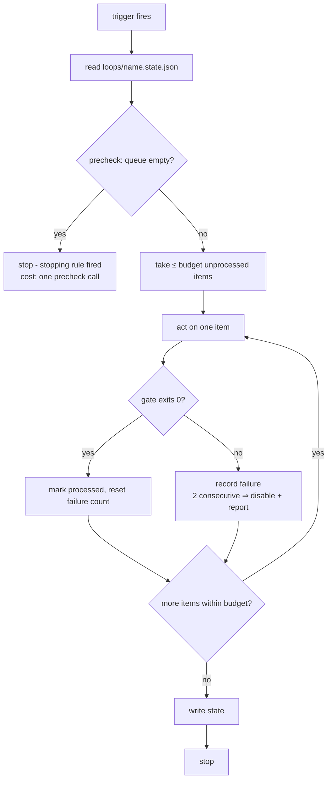
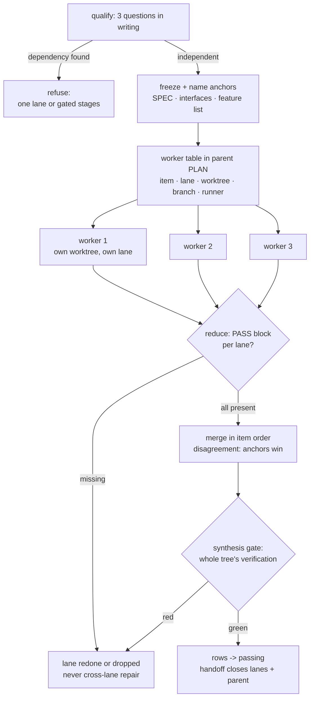

# How work executes: loops and graphs

This chapter covers the execution machinery above single lanes: **loops**
(standing automation — live since AE/2.2) and **graphs/reducers + runners**
(live since P4). The work lifecycle of a single lane is the
[work-lifecycle](work-lifecycle.md) chapter; this one is about work that
*keeps happening* and work that *happens in parallel*.

## Loops: standing automation as a file

A loop is not a lane. Lanes are per-effort: they open, they close, their
folder disappears. A loop persists: it fires on a cadence or an event,
works through a **queue** of discrete items, proves each item with a
**gate**, and stops inside a **budget**. The insight the whole layer rests
on: a loop is a *contract*, and the contract is a file —
`loops/<name>.md` in the owning repo — so the same loop runs identically
whether an Orca automation fires it at 09:00, a cron job fires it on a
bare machine, or a human tells an agent "run one iteration of
loops/self-audit.md".

The five elements every loop file carries (template:
`templates/repo/loops/LOOP.md.template`, instantiated by `loop-setup`,
never speculatively):

| Element | What it prevents |
|---|---|
| Stopping rule (one sentence) | loops that run because nobody said stop |
| Gate (verified command) | "improved" without an exit code |
| Budget (numeric + failure budget) | waste growing past what the cadence absorbs |
| State file (JSON) | reprocessing items; silent repeated failure |
| Trigger (primary + fallback) | marrying a runtime |

The **failure budget** deserves its own sentence: two consecutive failed
runs disable the loop and summon a human. A loop that trips this
repeatedly has a wrong gate or a wrong queue — the fix is editing the
definition, never widening the budget.

## One run, any runner

Two properties matter. **Empty runs are nearly free** — the queue check
runs before anything expensive (Orca's automation `--precheck` can
front-run it; the protocol keeps the same check so the loop is correct on
any trigger). And **state
lives in a file**, not in anyone's memory: `processed` keys are never
reprocessed, `consecutive_failures` survives restarts, and any runner can
resume where any other stopped.

Writes to external systems (tracker comments, status moves) default to
**report-only** until the owner enables them. Reads are free; writes are a
decision.

## The trigger matrix

| Trigger | Command |
|---|---|
| Schedule | `orca automations create --trigger hourly\|daily\|weekly\|cron\|RRULE … --disabled` (enabled on explicit go) |
| On new issue | a scheduled automation whose precheck is `orca linear list --filter open --json` non-empty |
| Manual (universal fallback) | `orca automations run <name>`, or "run one iteration of `loops/<name>.md`" to any agent — with or without Orca |

The automation's `--prompt` says "follow `loops/<name>.md`" — it never
duplicates the contract. One source of truth; the trigger is just an alarm
clock.

## The Orca mapping (and the no-Orca contract)

Orca is the executor of the standard (ADR-001). The full table with
verified CLI syntax lives in `reference/orca.md`; the shape of it:

- **lane** → child worktree (`orca worktree create`, `--linear-issue`
  links the tracker); the card mirrors the lane (`--workspace-status`,
  `--comment` checkpoints).
- **worker (fan-out)** → agent-first create: `orca worktree create
  --agent <id> --prompt "<brief>" --parent-worktree active` — one command
  per worker.
- **long-lived process** → terminal tab that outlives the agent session
  (`orca terminal create`). Never a background shell inside an agent
  session.
- **DAG + gates** → `orca orchestration` runs/tasks/dispatch/inbox.
- **loop** → `orca automations`, created `--disabled`.

Where Orca is absent, one universal rule replaces every fallback recipe —
the **no-Orca contract**: an agent may do everything that is a file (read
and write lanes, run gates, append PASS blocks, execute one manual
iteration of any loop); it may not schedule, parallelize with managed
worktrees, or write to the tracker; on hitting an Orca-only step it
declares it explicitly ("no Orca — X was NOT done; needs an Orca session
or the operator") and continues with what remains. Never silently
skipped, never faked. Features trim; quality never does — the gates were
never Orca's to begin with.

## The tracker connector

`reference/tracker.md` owns the contract: the tracker holds workflow
state, the repo holds verification state, an issue reaches Done only when
the repo says `passing`, and truth flows repo → tracker after
verification, never before. Loops that *read* the tracker (triage) are the
cheap end; loops never move issues to Done — that path always runs through
`work-verify` → `work-handoff`. The connector is `orca linear`; without
Orca the calls are emitted for the operator and the tracker is declared
NOT updated (the contract applied to the tracker) — never a claimed write
without a confirmed call. PRs live on the GitHub plane (open, review,
comment via `gh`); GitHub issues are not intake — they get triaged into
the tracker. With the Linear↔GitHub integration connected, `Closes
<KEY>` in the PR body moves the issue on merge — the strongest form of
repo → tracker truth. The full wiring between the three planes — app
installs, branch formats, who writes what — is
[integrations.md](integrations.md)'s subject.

## This repo's own loops

Dogfooding again: `loops/self-audit.md` is the standing weekly self-audit
of this repo (gate: self-lint + every suite; one iteration of the
repo-local `.claude/skills/docs-sweep` drift battery; queue: drift
findings; trigger: Orca automation, fallback documented in the file), and
`loops/issue-triage.md` is the live instance of the triage example —
each weekday it reads the owner's Linear queue and tiers what arrived,
posting the triage as a comment (writes owner-enabled 2026-08-17; the
gate rule keeps Done out of its reach). State files sit
beside them, gitignored. They exist because the anti-decay rule and the
intake plane deserve a cadence, not just good intentions at merge time.

## Graphs: parallel work that merges deterministically

The graph layer coordinates many lanes: a DAG with verification gates on
the edges, and fan-out/fan-in as the working shape. Since AE/2.5 the
layer has a tier that owns it: fan-out is **mandatory at XL** — work that
cannot fit one lane (ADR-002) — and available at L. The `fan-out` skill
refuses the split until the **three pre-fan-out questions** are answered
in writing in the parent lane's PLAN — where does each unit work, how do
results merge, who resolves disagreement — because a fan-out you can't
write down is a queue wearing a costume.

Three properties carry the layer. **Anchors** — the SPEC, interfaces, and
feature list frozen read-only before the split — keep parallel lanes from
drifting apart while nobody watches; a worker that diverges from an anchor
loses by rule, and the divergence is recorded (maybe the anchor was
wrong — that becomes its own lane later). **The reducer contract** makes
merging mechanical: fixed output shape (the Verification PASS block plus a
short summary — the standard's existing currency), deterministic merge
order, a named resolver, and a synthesis gate on the merged whole, because
per-lane tests are structurally blind to mismatches *between* lanes.
**Failure locality**: a failed lane is redone or dropped, never repaired
by a sibling reaching across — cross-lane repair couples what the
worktrees isolated.

The tax is real (`reference/graphs-and-reducers.md`): every worker and
edge costs coordination, so fan-out pays only on true independence, with
the smallest worker count that keeps items independent.

## Runners: any file-reading agent can hold a lane

`reference/runners.md` is the per-runner surface: entry file, skills
support, verified spawn command. The design premise is that work state
lives in files — canonical AGENTS.md plus lane folders — so a worker's
runner is a free choice per row of the worker table: Claude Code today,
codex or opencode or dsh tomorrow, with zero runner-specific files (the
adapter ban holds mid-fan-out; runners without SKILL.md support are told
to read the skill file and follow it as a procedure). "Verify on install"
is a hard rule: no spawn command enters a worker table until it ran on the
target machine.

The standard's portability proof is exactly this claim made falsifiable: a
non-Claude runner completing a prepared lane end to end from the artifacts
alone. **It ran and passed** (2026-08-16): opencode 1.18.18 driving
`deepseek-v4-flash-free` executed the prepared `f04-capitalize` lane —
TDD red→green, full suite 32/32, the PASS block appended in the house
shape, only the allowed files touched, zero runner-specific files — and
the coordinator re-verified everything independently, catching a SPEC
ambiguity the worker missed (the checker seat works across runners too).
