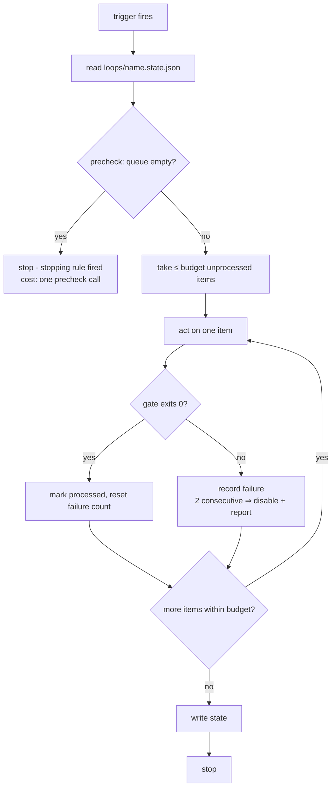
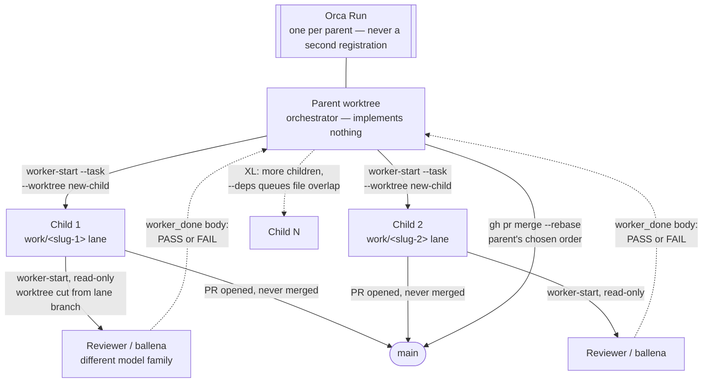
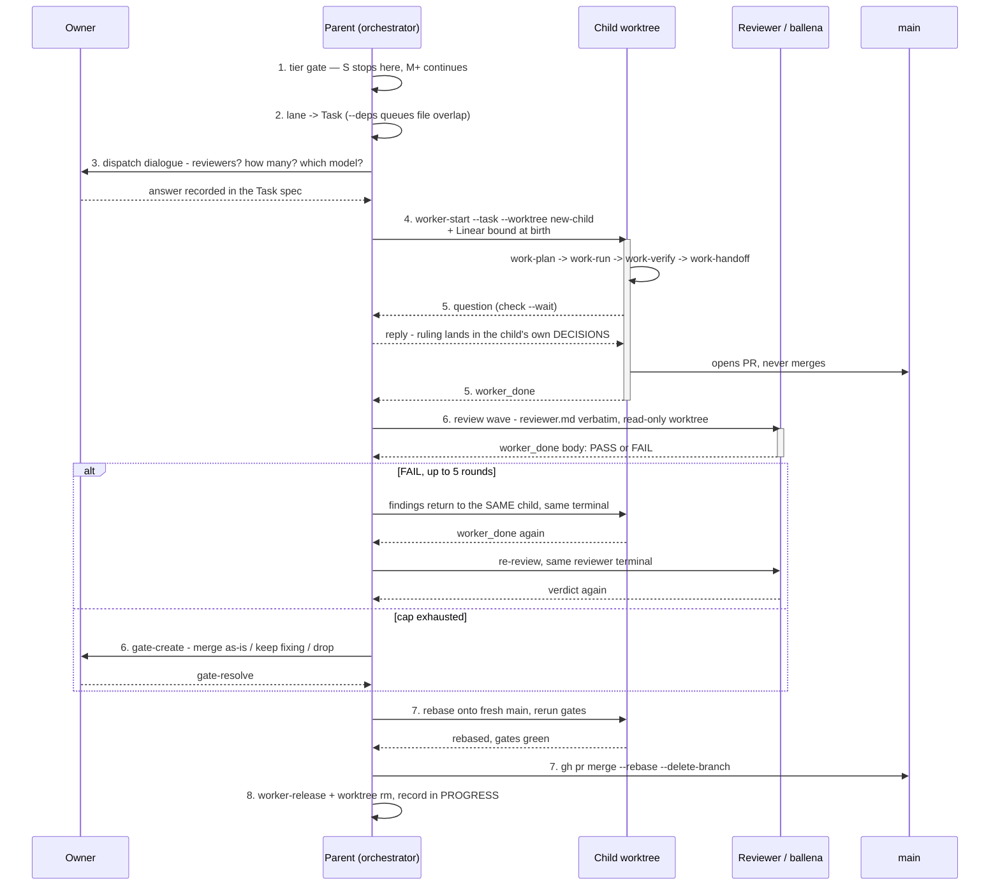
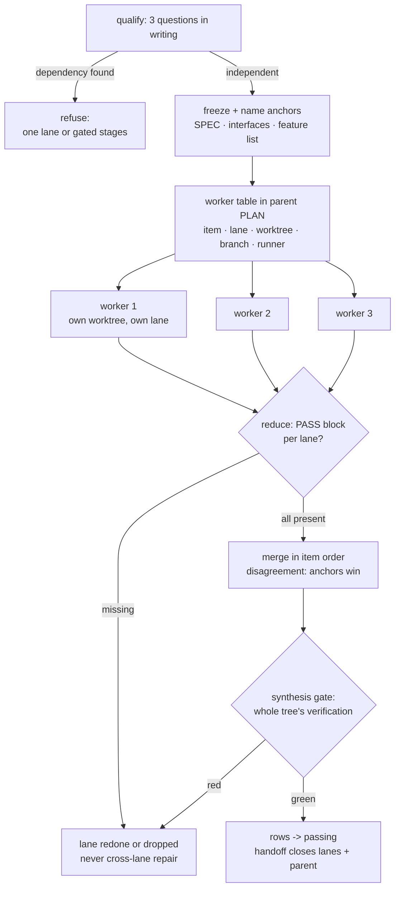

# How work executes: loops and graphs

This chapter covers the execution machinery above single lanes: **loops**
(standing automation — live since AE/2.2) and **graphs/reducers + runners**
(live since P4). The work lifecycle of a single lane — including
work-run, the step-by-step executor inside one lane (ADR-004) — is the
[work-lifecycle](work-lifecycle.md) chapter; this one is about work that
*keeps happening* and work that *happens in parallel*. The pairing is
symmetric: work-run = sequential within a lane; orchestrate = parallel
across lanes, one child worktree per lane (ADR-008) — both hand a worker
the same package, the lane.

## Loops: standing automation as a file

A loop is not a lane. Lanes are per-effort: they open, they close, their
folder disappears. A loop persists: it fires on a cadence or an event,
works through a **queue** of discrete items, proves each item with a
**gate**, and stops inside a **budget**. The insight the whole layer rests
on: a loop is a *contract*, and the contract is a file —
`loops/<name>.md` in the owning repo — so the same loop runs identically
whether an Orca automation fires it at 09:00, a cron job fires it on a
bare machine, or a human tells an agent "run one iteration of
loops/self-audit.md".

The five elements every loop file carries (template:
`templates/repo/loops/LOOP.md.template`, instantiated by `loop-setup`,
never speculatively):

| Element | What it prevents |
|---|---|
| Stopping rule (one sentence) | loops that run because nobody said stop |
| Gate (verified command) | "improved" without an exit code |
| Budget (numeric + failure budget) | waste growing past what the cadence absorbs |
| State file (JSON) | reprocessing items; silent repeated failure |
| Trigger (primary + fallback) | marrying a runtime |

The **failure budget** deserves its own sentence: two consecutive failed
runs disable the loop and summon a human. A loop that trips this
repeatedly has a wrong gate or a wrong queue — the fix is editing the
definition, never widening the budget.

## One run, any runner

Every runner — Orca automation, cron, or an agent told to run one
iteration — walks the same shape, from trigger to the next stop:

What to see: three things happen in that loop. **Empty runs are nearly
free** — the queue check at `Q` runs before anything expensive, so a
fired trigger with nothing to do costs one precheck call (Orca's
automation `--precheck` can front-run it; the protocol keeps the same
check so the loop is correct on any trigger). **The failure budget trips
inside the loop, not beside it** — `G`'s no branch is `F`: record the
failure, and on the second consecutive miss, disable the loop and report
to a human, right there mid-run rather than at some separate audit step.
And **state lives in a file**, not in anyone's memory: `processed` keys
are never reprocessed, `consecutive_failures` survives restarts, and any
runner can resume where any other stopped.

Writes to external systems (tracker comments, status moves) default to
**report-only** until the owner enables them. Reads are free; writes are a
decision.

## The trigger matrix

| Trigger | Command |
|---|---|
| Schedule | `orca automations create --trigger hourly\|daily\|weekly\|cron\|RRULE … --disabled` (enabled on explicit go) |
| On new issue | a scheduled automation whose precheck is `orca linear list --filter open --json` non-empty |
| Manual (universal fallback) | `orca automations run <name>`, or "run one iteration of `loops/<name>.md`" to any agent — with or without Orca |

The automation's `--prompt` says "follow `loops/<name>.md`" — it never
duplicates the contract. One source of truth; the trigger is just an alarm
clock.

## The Orca mapping (and the no-Orca contract)

Orca is the executor of the standard (ADR-001). The full table with
verified CLI syntax lives in `reference/orca.md`; the shape of it:

- **lane** → child worktree (`orca worktree create`, `--linear-issue`
  links the tracker); the card mirrors the lane (`--workspace-status`,
  `--comment` checkpoints).
- **child (orchestrate)** → supervised birth via `orca orchestration
  worker-start --task <id> --worktree new-child` (full Task + Dispatch +
  launch provenance); the raw `worktree create --agent --prompt` form is
  reserved for an unsupervised full-transfer handoff, never a dispatched
  child.
- **long-lived process** → terminal tab that outlives the agent session
  (`orca terminal create`). Never a background shell inside an agent
  session.
- **DAG + gates** → `orca orchestration` runs/tasks/dispatch/inbox.
- **loop** → `orca automations`, created `--disabled`.

Where Orca is absent, one universal rule replaces every fallback recipe —
the **no-Orca contract**: an agent may do everything that is a file (read
and write lanes, run gates, append PASS blocks, execute one manual
iteration of any loop); it may not schedule, parallelize with managed
worktrees, or write to the tracker; on hitting an Orca-only step it
declares it explicitly ("no Orca — X was NOT done; needs an Orca session
or the operator") and continues with what remains. Never silently
skipped, never faked. Features trim; quality never does — the gates were
never Orca's to begin with.

## The tracker connector

`reference/tracker.md` owns the contract: the tracker holds workflow
state, the repo holds verification state, an issue reaches Done only when
the repo says `passing`, and truth flows repo → tracker after
verification, never before. Loops that *read* the tracker (triage) are the
cheap end; loops never move issues to Done — that path always runs through
`work-verify` → `work-handoff`. The connector is `orca linear`; without
Orca the calls are emitted for the operator and the tracker is declared
NOT updated (the contract applied to the tracker) — never a claimed write
without a confirmed call. PRs live on the GitHub plane (open, review,
comment via `gh`); GitHub issues are not intake — they get triaged into
the tracker. With the Linear↔GitHub integration connected, `Closes
<KEY>` in the PR body moves the issue on merge — the strongest form of
repo → tracker truth. The full wiring between the three planes — app
installs, branch formats, who writes what — is
[integrations.md](integrations.md)'s subject.

## This repo's own loops

Dogfooding again: `loops/self-audit.md` is the standing weekly self-audit
of this repo (gate: self-lint + every suite; one iteration of the
repo-local `.claude/skills/docs-sweep` drift battery; queue: drift
findings; trigger: Orca automation, fallback documented in the file), and
`loops/issue-triage.md` is the live instance of the triage example —
each weekday it sweeps open GitHub issues on this repo into the tracker
(mirror issue + "tracked as" comment: external reports enter the same
pipeline as internal work), then reads the owner's Linear queue and
tiers what arrived, posting the triage as a comment (writes
owner-enabled 2026-08-17; the gate rule keeps Done out of its reach). State files sit
beside them, gitignored. They exist because the anti-decay rule and the
intake plane deserve a cadence, not just good intentions at merge time.

## Orchestration: the graph layer's parent/child cycle

This is the graph layer from `architecture.md`'s six-layer table —
coordinating many lanes with verification gates on the edges — now owned
end to end by one skill: **orchestrate** (`skills/orchestrate`, ADR-008).
It maps AE onto Orca's native orchestration primitives (Run, Task,
Dispatch, `worker_done`, decision gates) instead of inventing
coordination, and it absorbed `fan-out` (closed finalize-then-remove;
`reference/skills.md`) — the same skill now owns both the one-child case,
which is every M+ task, and the many-children case, XL, below.

The tier gate is unconditional: **S** resolves inline in the parent, no
lane, no Task, no child. **M and above always goes to a child** — the
parent's own checkout never touches the work it is supervising, and
"this M is two lines, I'll just do it here" is exactly the thought the
skill refuses.

### Topology: one Run, its children, their reviewers

What to see: every arrow into a worktree is a `worker-start`, never the
raw `worktree create --agent --prompt` form — that full-handoff path is
for an unsupervised transfer, not a dispatched child (the Orca mapping
above). Reviewers sit one hop off the *child*, not off the parent: their
worktree is cut from the lane's own branch, read-only, and their verdict
— the `worker_done` **body**, never `--outcome` — reports back to the
parent, never straight to the child; a child only ever sees a reviewer's
findings as something the parent relays. And only one arrow ever lands
on `main`: children open PRs but never merge them, so the parent is the
sole rebase point, in whatever order it has chosen — never arrival
order.

### The 8-stage dispatch cycle

Binding the Run (`run-current` / `run-create` / `run-use`) happens once
per parent session, before any lane exists. What repeats, once per lane,
is this cycle:

What to see: stages 5 and 6 are the two places the cycle can loop back —
`5` on a question (the ruling lands in the child's *own* DECISIONS, not
the parent's) and `6` on a FAIL (findings return to the *same* child's
terminal, never a fresh one, capped at five rounds before an owner gate
replaces the loop with a decision). Stage 7's ordering is easy to miss:
the rebase and re-gate happen *before* the merge, inside the child, not
after — a PASS earned against a stale `main` is not a PASS against the
`main` the PR is about to land on. And stage 8 is not optional
housekeeping: the reviewer's own dispatch and worktree are decommissioned
right alongside the child's — a retained ballena idles exactly as
expensively as a retained child.

### Several children at once (XL)

At XL — work that cannot fit one lane (ADR-002) — orchestrate dispatches
many children under one more rule: it refuses the split until the
**three pre-dispatch questions** are answered in writing in the parent
lane's PLAN — where does each unit work, how do results merge, who
resolves disagreement — because a parallel split you can't write down is
a queue wearing a costume. Mandatory at XL (ADR-008, superseding
ADR-002's original mandate), available at L.

What to see: two hard gates bracket the parallel middle, not one. `Q` is
a real fork — a dependency found routes straight to `ONE`, a refuse (one
lane or a gated sequence: `stages, not lanes` in the skill's own words),
and only the independent branch ever reaches the worker table. `R`
mirrors it on the way back: reduce refuses to merge any lane without a
current PASS block, sending a `missing` lane to `BACK` — redone or
dropped, never patched by a sibling reaching across — while only `all
present` proceeds to the merge. And clearing `R` still isn't the finish
line: the synthesis gate (`G`) re-runs the whole merged tree's
verification before any row moves to `passing`, because per-lane tests
are structurally blind to mismatches *between* lanes.

Four properties carry the rest of the layer. **Anchors** — the SPEC,
interfaces, and feature list frozen read-only the moment qualification
passes — keep parallel lanes from drifting apart while nobody watches; a
worker that diverges from an anchor loses by rule, and the divergence is
recorded (maybe the anchor was wrong — that becomes its own lane later).
**The reducer contract** makes merging mechanical once a lane clears `R`:
fixed output shape (the Verification PASS block plus a short summary —
the standard's existing currency), deterministic merge order (item
order, never arrival order), and anchors win any disagreement.
**Failure locality** holds throughout: any lane — refused up front,
missing its PASS, or failing synthesis — is redone or dropped, never
repaired by a sibling reaching in. And **one parent per repo**: two
parents over the same `main` are two merge queues on one branch, allowed
only with disjoint file scopes and disjoint lanes agreed in writing —
otherwise the second waits, or becomes a child itself.

The tax is real (`reference/graphs-and-reducers.md`): every worker and
edge costs coordination, so orchestrate pays only on true independence,
with the smallest worker count that keeps items independent.

## Runners: any file-reading agent can hold a lane

`reference/runners.md` is the per-runner surface: entry file, skills
support, verified spawn command. The design premise is that work state
lives in files — canonical AGENTS.md plus lane folders — so a worker's
runner is a free choice per row of the worker table: Claude Code today,
codex or opencode or dsh tomorrow, with zero runner-specific files (the
adapter ban holds mid-dispatch; runners without SKILL.md support are told
to read the skill file and follow it as a procedure). "Verify on install"
is a hard rule: no spawn command enters a worker table until it ran on the
target machine.

The standard's portability proof is exactly this claim made falsifiable: a
non-Claude runner completing a prepared lane end to end from the artifacts
alone. **It ran and passed** (2026-08-16): opencode 1.18.18 driving
`deepseek-v4-flash-free` executed the prepared `f04-capitalize` lane —
TDD red→green, full suite 32/32, the PASS block appended in the house
shape, only the allowed files touched, zero runner-specific files — and
the coordinator re-verified everything independently, catching a SPEC
ambiguity the worker missed (the checker seat works across runners too).
