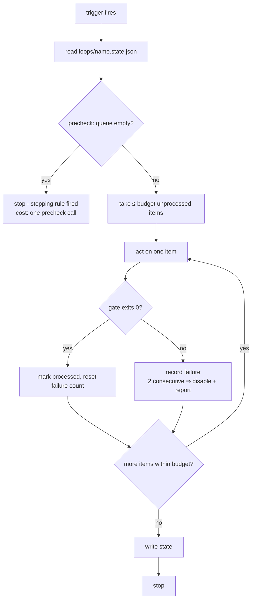

# How work executes: loops, and soon graphs

This chapter covers the execution machinery above single lanes: **loops**
(standing automation — live since AE/2.2) and **graphs/reducers + runners**
(> Phase: P4). The work lifecycle of a single lane is the
[work-lifecycle](work-lifecycle.md) chapter; this one is about work that
*keeps happening* and work that *happens in parallel*.

## Loops: standing automation as a file

A loop is not a lane. Lanes are per-effort: they open, they close, their
folder disappears. A loop persists: it fires on a cadence or an event,
works through a **queue** of discrete items, proves each item with a
**gate**, and stops inside a **budget**. The insight the whole layer rests
on: a loop is a *contract*, and the contract is a file —
`loops/<name>.md` in the owning repo — so the same loop runs identically
whether an Orca automation fires it at 09:00, a cron job fires it on a
bare machine, or a human tells an agent "run one iteration of
loops/self-audit.md".

The five elements every loop file carries (template:
`templates/repo/loops/LOOP.md.template`, instantiated by `loop-setup`,
never speculatively):

| Element | What it prevents |
|---|---|
| Stopping rule (one sentence) | loops that run because nobody said stop |
| Gate (verified command) | "improved" without an exit code |
| Budget (numeric + failure budget) | waste growing past what the cadence absorbs |
| State file (JSON) | reprocessing items; silent repeated failure |
| Trigger (primary + fallback) | marrying a runtime |

The **failure budget** deserves its own sentence: two consecutive failed
runs disable the loop and summon a human. A loop that trips this
repeatedly has a wrong gate or a wrong queue — the fix is editing the
definition, never widening the budget.

## One run, any runner

Two properties matter. **Empty runs are nearly free** — the queue check
runs before anything expensive (Orca's automation `--precheck` can
front-run it; the protocol keeps the same check so the loop is correct on
any trigger). And **state
lives in a file**, not in anyone's memory: `processed` keys are never
reprocessed, `consecutive_failures` survives restarts, and any runner can
resume where any other stopped.

Writes to external systems (tracker comments, status moves) default to
**report-only** until the owner enables them. Reads are free; writes are a
decision.

## The trigger matrix

| Trigger | Orca primary | No-Orca fallback |
|---|---|---|
| Schedule | `orca automations create --trigger hourly\|daily\|weekly\|cron\|RRULE` | `/schedule`, OS cron / Task Scheduler |
| On new issue | scheduled automation, precheck = `orca linear list --filter open --json` non-empty | cron + Linear MCP/API poll |
| Manual | `orca automations run <name>` | `/loop`, or "follow loops/<name>.md" to any agent |

The automation's `--prompt` says "follow `loops/<name>.md`" — it never
duplicates the contract. One source of truth; the trigger is just an alarm
clock.

## The Orca mapping (and life without Orca)

Orca is the preferred executor and never a dependency (Decision 9). The
full table with verified CLI syntax lives in `reference/orca.md`; the
shape of it:

- **lane** → child worktree (`orca worktree create`, `--linear-issue`
  links the tracker) — or plain `git worktree add`.
- **long-lived process** → terminal tab that outlives the agent session
  (`orca terminal create`) — or a shell the agent doesn't own. Never a
  background shell inside an agent session.
- **DAG + gates** → `orca orchestration` runs/tasks/dispatch — or a plan
  doc with manual gate commands.
- **loop** → `orca automations` — or `/loop`, `/schedule`, cron.

A repo authored on an Orca machine runs unchanged on a cron-and-worktree
machine; if it doesn't, the repo broke the standard, not the machine.

## The tracker connector

`reference/tracker.md` owns the contract: the tracker holds workflow
state, the repo holds verification state, an issue reaches Done only when
the repo says `passing`, and truth flows repo → tracker after
verification, never before. Loops that *read* the tracker (triage) are the
cheap end; loops never move issues to Done — that path always runs through
`work-verify` → `work-handoff`. The connector ladder is honest at every
rung: `orca linear` CLI → Linear MCP server → plain API → emit the calls
for the operator and say the tracker was NOT updated.

## This repo's own loops

Dogfooding again: `loops/self-audit.md` is the standing weekly self-audit
of this repo (gate: self-lint + both suites; queue: drift findings;
trigger: Orca automation, fallback documented in the file). Its state file
sits beside it. It exists because the how-it-works anti-decay rule and the
dogfooding gate deserve a cadence, not just good intentions at merge time.

## Graphs, reducers, runners

> Phase: P4

The parallel half of execution arrives next: `fan-out` (lanes × worktrees,
the three pre-fan-out questions, reducer contracts between workers and
synthesis), `reference/graphs-and-reducers.md`, and `reference/runners.md`
(per-runner entry files and spawn commands — Claude Code, codex, opencode,
grok, dsh — with the portability proof: a non-Claude runner completing a
lane end to end from the file artifacts alone).
