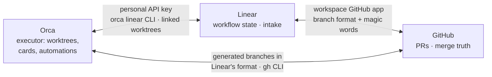
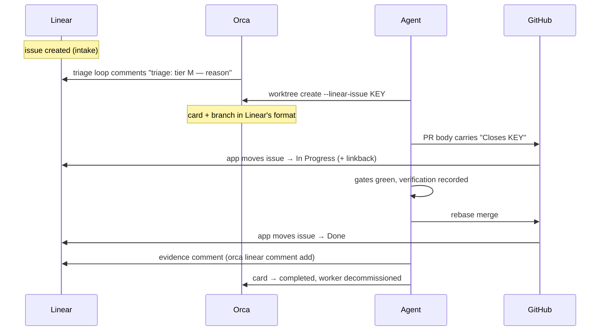

# How the planes connect: Linear ↔ GitHub ↔ Orca

Three surfaces coordinate every unit of work, and no fact lives on two of
them: **Linear** owns workflow state (what needs doing, what state it is
in), **GitHub** owns the merge truth (PRs, review, what actually landed on
main), and **Orca** executes (worktrees, cards, terminals, automations).
This chapter explains the wiring between them — how each edge is physically
connected, what happens on each event, and which writes belong to whom.
Everything here was verified live on this machine (2026-08-16/17); the
normative rules live in `reference/tracker.md` and `reference/orca.md`.

## The triangle

The property that makes the triangle work: each edge carries a different
kind of truth, so nothing is bookkept twice. Intent flows Linear → repo
(triage reads the tracker); execution truth flows repo → Linear (states
move only after verification); and the strongest repo → tracker signal is
not an API call at all — it is the merge itself.

## Each edge, physically

### Linear ↔ GitHub — the workspace app

The automation runs through Linear's **workspace GitHub app**, installed
on the org by an org owner (Linear: Settings → Integrations → GitHub).
Two mechanisms link a PR to an issue:

- **Branch format** — Linear's team setting defines a branch name pattern
  (`username/identifier-title`, e.g. `bygama/mat-5-fixture-refresh`); any
  branch carrying the issue key autolinks.
- **Magic words** — `Closes MAT-12` / `Fixes MAT-12` in the PR body link
  the PR *and* mark the issue for closing on merge; `ref MAT-12` /
  `part of MAT-12` link without closing.

Once linked, per-team automations (Workflows & automations → Pull
request) move the issue: **PR opened → In Progress** (plus a linkback
comment on the issue), **PR merged → Done**. Zero manual writes — proven
live repeatedly (MAT-9 through MAT-15).

The gotcha that cost a debugging session: a user-level **"Connected
account"** (Linear: Settings → Account → Connected accounts) is
*attribution only* — it puts your avatar on events and does not move
anything. Only the workspace app automates. Verify the app is active
(integration-native PR activity appears on an issue) before relying on
it; without it, states move via `orca linear status set` as fallback.

### Orca ↔ Linear — the API key and the CLI

Orca connects to Linear with a **personal API key** pasted in Orca
(Settings → Integrations) — not an OAuth app. That single connection
powers:

- the `orca linear` command family (`issue`, `list`, `status set`,
  `comment add`, `create`, `team states`) — every tracker read and write
  an agent makes;
- **linked worktrees** — `orca worktree create --linear-issue <KEY>` ties
  a worktree (and its card) to an issue, after which `--current` targets
  that issue without repeating the key;
- **automations as intake readers** — the triage loop's precheck is
  `orca linear list --filter open --json`.

Before any tracker write, the agent verifies the live binding's workspace
matches the repo's declared workspace (reference/tracker.md, "Which
workspace — the repo declares, tools obey"); mismatch prevents the write.

### Orca ↔ GitHub — branches and the gh CLI

No app here; the edge is conventions. Orca generates branch names already
in Linear's branch format, so a worktree created from an issue produces a
branch that autolinks its PRs for free. PRs themselves are opened and
merged with the `gh` CLI (rebase merges, per house rules), and the Orca
card mirrors the lane lifecycle (`orca worktree set --workspace-status
in-progress|in-review|completed`, plus `--comment` checkpoints) so the
IDE shows what the repo knows.

## One issue, end to end

The full path, proven live (MAT-5 ran it with a spawned worker; MAT-9
onward run it daily):

What to see: only two arrows touch Linear's workflow state
(`G->>L: → In Progress`, `G->>L: → Done`), and neither originates at
the agent — both fire off the workspace app reacting to a GitHub event
the agent merely caused (the `Closes KEY` PR body, then the merge
itself). Every arrow the agent or Orca sends straight to Linear
(`O->>L` the triage comment, `A->>L` the evidence comment) is a
comment, never a status move — nothing in the happy path ever sets
Done by hand. That split is the same rule the table below tabulates:
state moves belong to the app, evidence stays the agent's job.

## Who writes what

| Fact | Written by | Where |
|---|---|---|
| Issue, priority, intent | owner (or triage intake) | Linear |
| Tier assessment | triage loop — comment only, never a status move | Linear comment |
| In Progress / Done | the workspace GitHub app, on PR open / merge | Linear |
| Evidence (what passed, how) | the agent, after verification | Linear comment + lane PROGRESS |
| Card status + checkpoints | the agent | Orca card |
| Manual status moves | fallback only — app absent or Orca unavailable | `orca linear status set` |

The gate rule caps all of it: an issue reaches Done only when the repo
side says `passing` — and with the app active, "the repo side says
passing" takes the physical form of a merged PR.

## One-time operator setup

Everything above needs five owner actions, each once per workspace/org:

1. Install the **workspace GitHub app** on the org and enable the
   per-team Pull request automations (opened → In Progress, merged →
   Done).
2. Set the team **branch format** to `username/identifier-title` — the
   shape Orca generates.
3. Paste a Linear **personal API key** into Orca (Settings →
   Integrations).
4. Point Linear's **coding-tools prompt template** at the standard —
   first line `Read AGENTS.md first; tier per docs/tiers.md.` — so any
   session opened from an issue starts inside it (`ae-init` reminds
   the owner of this when installing into a tracker-connected workspace).
5. Group repos as Linear **projects** (one per repo — this repo's is
   `Agent-Engineering`, created 2026-08-17): the team and its keys stay
   single, each repo gets its own board and progress view, and issues
   born from the flow carry the project.

## Hard-won gotchas

- **Connected account ≠ workspace app.** Attribution vs automation — see
  above. Events from before the app install are invisible to it.
- **Done is never pre-merge.** Workers are told "In Review → merge →
  Done"; with the app active, Done happens by itself and a manual move
  ahead of the merge is a lie the tracker will believe.
- **The evidence comment stays the agent's job.** The app moves states;
  it cannot say what passed. A Done with no evidence comment is a state
  without a proof.
- **Spawn briefs point at the issue, not at prose** — `orca terminal
  send` truncates long inline briefs; a worker that can read
  `orca linear issue <KEY> --current` reconstructs the task from the
  plane that owns it (`reference/orca.md`).
