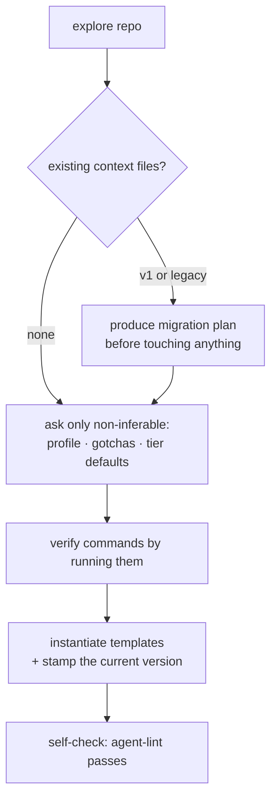
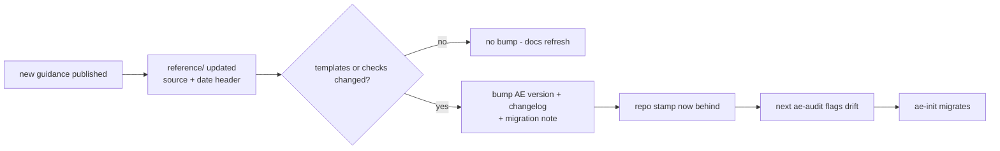

# The standard's lifecycle

A consuming repo moves through four moments: it gets **installed**, it hosts
**work**, it gets **audited**, and eventually it gets **updated** when the
standard itself moves. The whole cycle hangs on one greppable line in the
repo's `AGENTS.md`:

```
Standard: AE/<major>.<minor>.<patch>
```

That stamp is the contract between a repo and this one. It says which
version of the templates and checks the repo was built against, it is what
the audit compares against the current version, and it is the only
memory the system needs about "when was this repo last touched by the
standard".

> Live since AE/2.0: `ae-init`, `ae-audit`, and `agent-lint` implement every flow in this chapter.

Since AE/1.2.0, `using-ae` is the entry skill that recognizes an
AE-standard repo and routes an arriving task to whichever flow in this
chapter owns it — install, audit, or work — before any action. The
global layer wires it as a SessionStart hook, but that wiring is
optional plumbing, not a dependency: the skill still triggers by its
own description with no hook at all (detail: `global/hooks/README.md`,
`skills/using-ae/SKILL.md`).

Ten skills carry the whole surface this doc describes: the work chain
now opens with `shaping` (the design dialogue, ADR-006) ahead of
`work-plan`, `work-run`, `work-verify`, and `work-handoff`, with
`ae-init`, `ae-audit`, `loop-setup`, `orchestrate`, and `using-ae` itself
completing the set (README carries the full table and chain diagram).

## What a consuming repo carries

Always, and nothing more:

- **`AGENTS.md`** — canonical, ≤60 lines: what the repo is, verified
  commands, real gotchas, genuine hard constraints, an optional map, the
  tier one-liner, and the version stamp. Canonical means every agent — any
  model, any runtime — reads this file; nothing tool-specific forks it.
- **`CLAUDE.md`** — a pointer, ≤3 lines (`@AGENTS.md`), so Claude Code
  ingests the canonical file through its import mechanism. One canonical
  file plus one pointer; per-tool adapter files stay banned. A fenced
  tool-managed block does not count against the line budget — the lint's
  `pointer-shape` check settles what qualifies as one.
- **`docs/`** — decision records and rich-reference specs, indexed by a
  one-line-per-area README.

Deeper in the tree, the same pair repeats — but only where it is earned. A
directory gets its own `AGENTS.md` (≤30 lines) plus its own ≤3-line
`CLAUDE.md` pointer when it holds **non-inferable local knowledge**: commands
that differ from the root's, gotchas that bite only inside that subtree.
Never for symmetry — a sibling directory having one earns nothing here, and a
nested file that restates the root spends attention on every session that
touches the directory. Nesting has no privileged level: `apps/*` is the common
case, not the rule, and `packages/ui/core/` qualifies on the same test. When a
nested file and its ancestors disagree, precedence is nearest-wins — user
prompt, then the nearest `AGENTS.md`, then its ancestors — which is what the
agents.md standard specifies and what Claude Code's walk-up produces. The rule
lives in `reference/context.md`; `agent-lint` applies both budgets at any
depth, so no extra check is needed to hold it.

Per task — never as permanent furniture — a lane folder `work/<slug>/` with
the four files, and for the largest tier a `feature_list.json`. Those belong
to the [work lifecycle](work-lifecycle.md).

## Install (`ae-init`)

Installation is a conversation with the repo first and the human second: the
skill explores before it asks, asks only what it cannot infer, and proves
the commands it writes down by running them. An `AGENTS.md` that lists an
unverified test command is worse than none — it teaches every future agent a
lie.



What to see: the branch at `B` is the only judgment call the diagram
makes — everything else is sequence. A repo with no existing context
files (`B -->|none|`) goes straight to asking; a v1 or legacy repo
detours through `D` first, so a migration plan exists and is shown
*before* anything is touched, then rejoins the same path at `C`. The
diagram's close is a gate, not a formality: `G` re-runs the mechanical
lint the skill itself will be judged against, so an install that fails
its own check never gets called done.

Two arrival states get special handling:

- **A v1 repo** (the previous, context-only standard): the skill recognizes
  the old shape and upgrades it — flipping the canonical file, adding the
  stamp, installing the tier one-liner — without losing repo-specific
  content (gotchas, constraints, docs).
- **A legacy repo** (per-tool adapters, mandatory read orders, rule lists):
  the skill writes a migration plan and shows it before touching anything.
  Migration is a proposal, never an ambush.

One question in the interview scales with the repo. When a tracker is in
play, the install asks once where the repo tracks — and a repo of three or
more domains (`apps/*` plus top-level directories with manifests of their
own) gets that question with the answer already drafted: an initiative named
after the repo, one project per domain named from its folder — the structure
`reference/tracker.md` ("Which workspace — the repo declares, tools obey")
defines for a deep monorepo. The owner still supplies workspace and team
key, and still answers once —
approve, edit in the same breath, or "none". The alternative is a question
per domain, which is exactly the friction that gets answered "skip", after
which the repo declares nothing at all. On approval the install creates only
the Linear objects that are missing; where no Orca session can write them it
says so and emits the exact operations for the operator, and the declaration
lines land in the files regardless — the repo saying where work belongs does
not wait on the projects existing. Below three domains the question is the
single one it has always been.

One line the install writes without asking at all is the browser gotcha, and
only where the repo earns it. When step 1 finds a UI stack — the same signal
that makes the install offer `DESIGN.md.template` — the root `AGENTS.md`
gains a single Gotchas line: prefer the runner's own embedded or app-managed
browser, reach for a driven-browser MCP only for a capability that browser
lacks (performance traces, heap snapshots, a11y audits, device emulation),
and never drive one from a supervised child session, which owns that
long-lived process, stalls while it runs, and takes it down on the way out.
The rule is `reference/orca.md`'s browser criterion; what lands in the repo is
runtime-neutral — no runner, no product, no command — because the file
outlives the runner that installed it and has to read true on the next one.
A repo with no rendering surface gets neither the line nor a question about
it: advice nobody in that repo can act on is noise, which is why one
detection gates both this and the DESIGN.md offer.

Templates are instantiated, never copied verbatim: `{{PLACEHOLDER}}` markers
are filled from what the exploration found and what the human confirmed.

## Audit (`ae-audit`)

The audit is the judgment half of enforcement; `agent-lint` is the
mechanical half and runs inside it. The lint counts (budgets, stamp present
and parseable, pointer shape, broken links, command drift, lane coherence,
feature-list schema and gating sanity); the audit judges (is the entry file
honest? do the hard constraints deserve to be hard? has knowledge decayed?).
The output is a score with concrete fixes, and fixes are applied only when
asked — an audit that silently rewrites your repo is an audit nobody runs
twice.

Run against this repo itself (the dogfooding gate), the audit additionally
checks that `docs/how-it-works/` covers every top-level directory and every
skill, and flags chapters that lag behind structural changes.

## Update and migration

The standard moves when the world does: new guidance gets published, an
article changes our mind, a check earns its keep or stops earning it. The
flow keeps consuming repos honest without making them chase every edit:



What to see: `Q` is the only gate in the flow, and it decides whether
this round of guidance costs a consuming repo anything at all — a
docs-only refresh (`Q -->|no|`) never touches a stamp, so `N` is a dead
end with no consequence downstream. Only the `yes` branch reaches `S`,
and from there the asymmetry is the point: **repos never poll**. `AU`
and `M` fire on someone else's schedule — the next audit, the next
migration — not the moment `V` bumps the version. A consuming repo
learns it is behind the moment someone audits it, and catches up the
moment someone runs the migration. Between those moments it keeps
working on the version it was built against — stamps make drift
visible, not fatal.

The lifecycle also runs backward — **the standard improves from the
edges in**. An audit in a consuming repo labels standard-fault findings
`upstream` (excluded from the repo's score) and proposes filing them:
into the standard's tracker on machines that carry its workspace, or as
a public GitHub issue for anyone else. The triage loop sweeps those in,
the fix ships through the normal flow, the version bumps if templates
or checks changed — and the reporter receives their own fix through the
next migration.

## Versioning rules

- Stamp format: `Standard: AE/MAJOR.MINOR.PATCH` — one line, greppable,
  in the installed `AGENTS.md` (SemVer-shaped since ADR-003; two-part
  stamps from the 0.x era stay valid shapes and read as behind, not
  malformed).
- Semantics (the criterion, spelled out in the CHANGELOG header;
  milestone-weighted since ADR-007): breaking shape changes bump MAJOR;
  MINOR is an owner-designated milestone package; everything else
  backward compatible — fixes, errata, and incremental capability —
  bumps PATCH. Template or check changes always land in a bump (related
  sets may accumulate unreleased and ship together, owner-paced);
  docs-only refreshes never bump, because `reference/` files carry
  their own source+date headers.
- The line's history: 0.1.0 was the predecessor generation (canonical
  CLAUDE.md, no stamps — the retired Context-Engineering repo); the
  AE/2.x era is renumbered as the 0.x initial-development line; 1.0.0
  declared the standard stable on 2026-08-17 (ADR-003; former names kept
  per CHANGELOG entry).
- A bump restamps this repo's root `AGENTS.md` in the same change and
  tags the release (`vMAJOR.MINOR.PATCH`); the README badge reads the
  latest tag by itself, so it can never drift (the rule lives in the
  `CHANGELOG.md` header). `examples/` stamps are authoring-time
  snapshots — never restamped.
- History: `CHANGELOG.md` at this repo's root records every bump and what
  it means for consumers.
- The ritual is operationalized by the repo-local `.claude/skills/release`
  skill — sizing, entry, note, restamps, gates, tag, one procedure.
- Migration notes: `skills/ae-init/references/migration.md` records, per
  version step, exactly what changes in an installed repo — that file is what
  `ae-init` executes when the audit says "behind".
