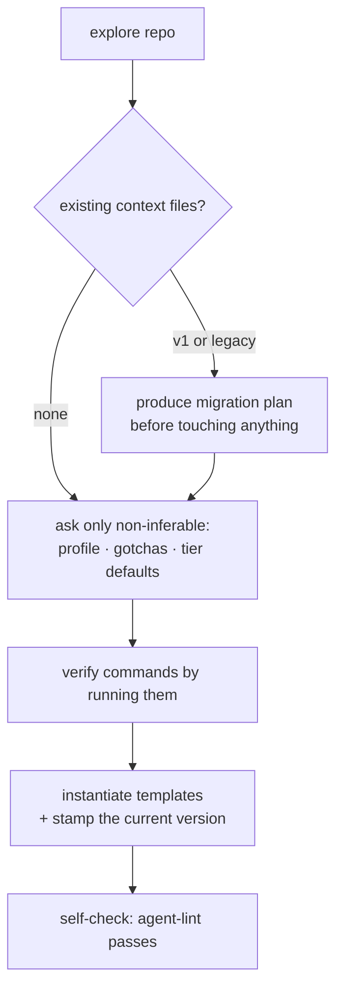
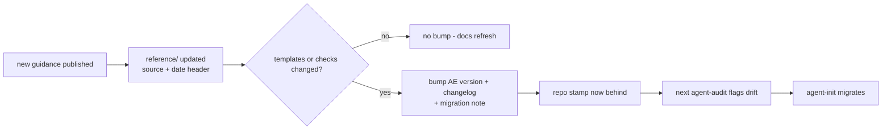

# The standard's lifecycle

A consuming repo moves through four moments: it gets **installed**, it hosts
**work**, it gets **audited**, and eventually it gets **updated** when the
standard itself moves. The whole cycle hangs on one greppable line in the
repo's `AGENTS.md`:

```
Standard: AE/<major>.<minor>
```

That stamp is the contract between a repo and this one. It says which
version of the templates and checks the repo was built against, it is what
the audit compares against the current version, and it is the only
memory the system needs about "when was this repo last touched by the
standard".

> Live since AE/2.0: `agent-init`, `agent-audit`, and `agent-lint` implement every flow in this chapter.

## What a consuming repo carries

Always, and nothing more:

- **`AGENTS.md`** — canonical, ≤60 lines: what the repo is, verified
  commands, real gotchas, genuine hard constraints, an optional map, the
  tier one-liner, and the version stamp. Canonical means every agent — any
  model, any runtime — reads this file; nothing tool-specific forks it.
- **`CLAUDE.md`** — a pointer, ≤3 lines (`@AGENTS.md`), so Claude Code
  ingests the canonical file through its import mechanism. One canonical
  file plus one pointer; per-tool adapter files stay banned.
- **`docs/`** — decision records and rich-reference specs, indexed by a
  one-line-per-area README.

Per task — never as permanent furniture — a lane folder `work/<slug>/` with
the four files, and for the largest tier a `feature_list.json`. Those belong
to the [work lifecycle](work-lifecycle.md).

## Install (`agent-init`)

Installation is a conversation with the repo first and the human second: the
skill explores before it asks, asks only what it cannot infer, and proves
the commands it writes down by running them. An `AGENTS.md` that lists an
unverified test command is worse than none — it teaches every future agent a
lie.



Two arrival states get special handling:

- **A v1 repo** (the previous, context-only standard): the skill recognizes
  the old shape and upgrades it — flipping the canonical file, adding the
  stamp, installing the tier one-liner — without losing repo-specific
  content (gotchas, constraints, docs).
- **A legacy repo** (per-tool adapters, mandatory read orders, rule lists):
  the skill writes a migration plan and shows it before touching anything.
  Migration is a proposal, never an ambush.

Templates are instantiated, never copied verbatim: `{{PLACEHOLDER}}` markers
are filled from what the exploration found and what the human confirmed.

## Audit (`agent-audit`)

The audit is the judgment half of enforcement; `agent-lint` is the
mechanical half and runs inside it. The lint counts (budgets, stamp present
and parseable, pointer shape, broken links, command drift, lane coherence,
feature-list schema and gating sanity); the audit judges (is the entry file
honest? do the hard constraints deserve to be hard? has knowledge decayed?).
The output is a score with concrete fixes, and fixes are applied only when
asked — an audit that silently rewrites your repo is an audit nobody runs
twice.

Run against this repo itself (the dogfooding gate), the audit additionally
checks that `docs/how-it-works/` covers every top-level directory and every
skill, and flags chapters that lag behind structural changes.

## Update and migration

The standard moves when the world does: new guidance gets published, an
article changes our mind, a check earns its keep or stops earning it. The
flow keeps consuming repos honest without making them chase every edit:



The important property: **repos never poll**. A consuming repo learns it is
behind the moment someone audits it, and catches up the moment someone runs
the migration. Between those moments it keeps working on the version it was
built against — stamps make drift visible, not fatal.

## Versioning rules

- Stamp format: `Standard: AE/<major>.<minor>` — one line, greppable,
  in the installed `AGENTS.md`.
- Semantics: template or check changes bump the version (breaking shape
  changes bump major, additive ones minor); docs-only refreshes bump
  nothing, because `reference/` files carry their own source+date headers.
- History: `CHANGELOG.md` at this repo's root records every bump and what
  it means for consumers.
- Migration notes: `skills/agent-init/references/migration.md` records, per
  version step, exactly what changes in an installed repo — that file is what
  `agent-init` executes when the audit says "behind".
