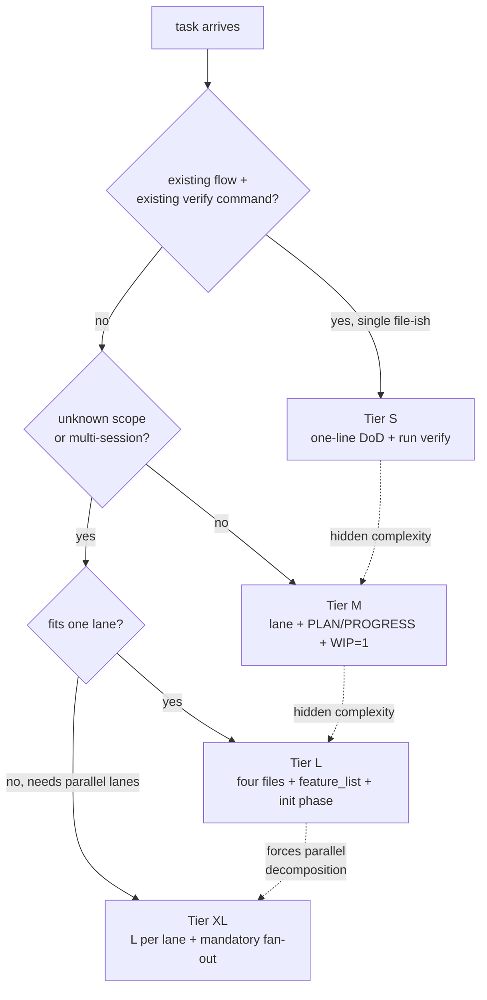
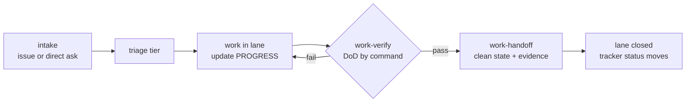
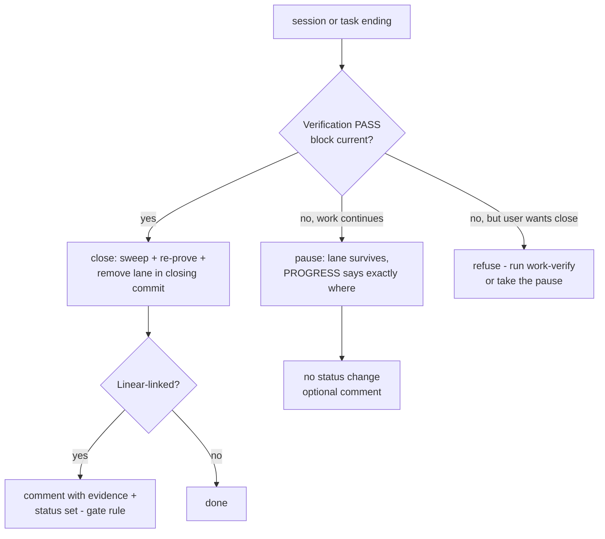
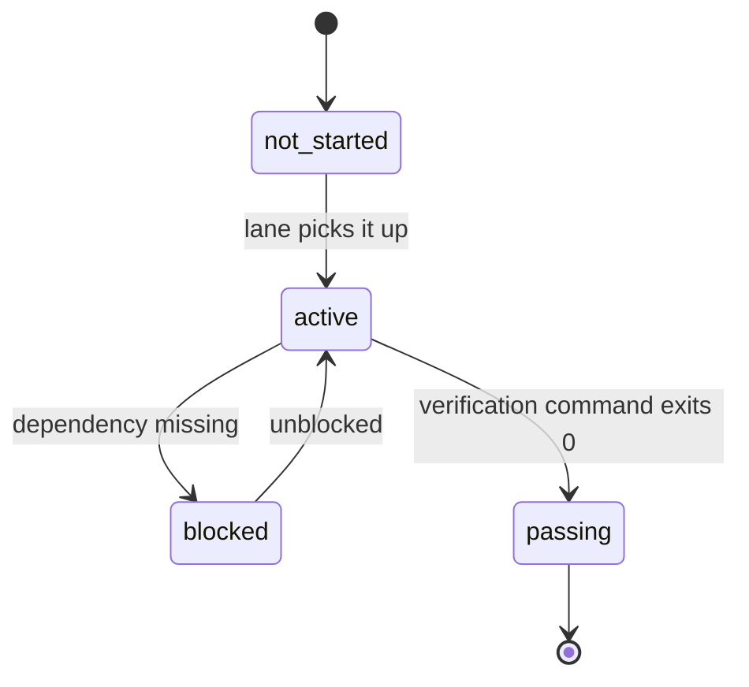

# How work runs under the standard

Three principles govern every task, whatever its size:

1. **Ceremony scales with the tier.** A one-file fix and a new subsystem do
   not deserve the same paperwork — but each deserves exactly its own.
2. **Evidence over confidence.** "The agent says it's done" is never a
   completion state. A command that exits 0 is.
3. **One lane in progress at a time (WIP=1).** Five half-finished features
   are worth less than one finished one; parallelism comes from isolated
   lanes, never from one agent juggling.

## Tier triage

The rule, from the spec as amended by ADR-002: **S** requires an existing
flow to change *and* an existing verify command; anything creating new
flows or crossing modules starts at **M**; unknown scope or a
multi-session horizon is **L**; and work that cannot fit one lane — a
correct PLAN forces two or more independent lanes in parallel — is **XL**.
When in doubt, take the higher tier.



The dotted arrows are the **ratchet**, and it only turns one way: a task
that reveals hidden complexity upgrades mid-flight — S to M, M to L, L to
XL — and nothing ever downgrades mid-task. Downgrading is how half-done
work gets declared simple retroactively; the ratchet exists to make that
impossible.

| Tier | Example | Ceremony |
|---|---|---|
| S | one-file front fix | one-line definition of done, run the verify command, no files |
| M | a feature | DoD written *first*, lane folder with PLAN + PROGRESS, WIP=1, fresh-context review, clean-state exit |
| L | build a system | full four files + `feature_list.json` + a dedicated init phase + staged context windows |
| XL | migrate six repos in one push | everything L per worker lane + mandatory fan-out: three questions in writing, frozen anchors, worker table, reducer contract, synthesis gate on the merged whole ([execution.md](execution.md)) |

XL is structural, never size-based: it begins exactly where one lane
stops being able to hold the work, and its ceremony is the graph
machinery made compulsory — the fan-out skill refuses an XL effort whose
three questions were never written down, and work-verify refuses an XL
"done" whose synthesis gate never ran. Consumer repos get the compact
version of this table as `docs/tiers.md` (installed by agent-init since
AE/2.5).

## The lane and the four files

> Templates live since AE/2.0 (`templates/repo/work/`); the enforcing skills (`work-verify`, `work-handoff`) live since AE/2.1.

A **lane** is one unit of work with its own folder: `work/<slug>/`, where
the slug carries the tracker issue key when one exists
(`work/STA-123-checkout-fix/`). Lanes are per-effort artifacts, never
permanent repo furniture — a closed lane's folder is deleted or archived by
the handoff, and an empty `work/` directory simply doesn't exist.

Why per-lane folders instead of files at the repo root: parallel worktrees.
Two agents working two lanes never collide on a shared `PROGRESS.md`, and a
lane travels intact when its worktree moves between machines or runners.

The four files, each with one job:

- **`SPEC.md`** — what this lane is building. The owner writes it; the agent
  never edits it. This is what keeps the target from drifting over a long
  run. (For M-tier work where the prompt or the issue *is* the spec, the
  file is optional.)
- **`PLAN.md`** — the steps, each with an executable acceptance criterion.
  Not "improve error handling" — "requests to /orders with a missing id
  return 400, and the test asserting this passes".
- **`PROGRESS.md`** — done / in progress / tried-and-failed / next, plus a
  `## Verification` section (since AE/2.1) holding PASS evidence only. The
  first thing any fresh session or takeover agent reads. If it isn't in this
  file, it didn't happen.
- **`DECISIONS.md`** — append-only: every choice made and why. Without it, a
  later session re-litigates a decision that took an hour to make.

The frontmatter of each file may carry `issue: <KEY>` when the lane is
tracker-linked; nothing breaks when it doesn't.

## The lane lifecycle



Intake can be a tracker issue or a direct request — the standard doesn't
care. Triage assigns the tier and, at M+, opens the lane folder with its
definition of done already written. Work loops inside the lane, updating
`PROGRESS.md` as it goes. The two exits are skills, not vibes — both live
since AE/2.1:

- **`work-verify`** runs the tier's definition of done and refuses "done"
  without evidence. Its output is a PASS block in the lane's
  `## Verification` section — the only currency the handoff accepts.
- **`work-handoff`** enforces the clean-state exit and knows two honest
  modes. **Close** requires the PASS block, sweeps debris (debug files,
  commented code, stray TODOs, scratch), re-proves build + tests + startup,
  and removes the lane folder in the closing commit — git history keeps the
  four files and their evidence, and no orphan `work/` directory survives.
  **Pause** is for sessions ending mid-work: the lane folder *survives*,
  PROGRESS names the exact state (a red test is allowed only as a recorded
  blocker), and the WIP gets committed honestly. A handoff with red tests
  claimed as done is not a handoff — it is a trap for the next session;
  pause exists precisely so nobody is tempted to fake a close. Since
  AE/2.4 the handoff also mirrors the Orca card: close sets
  `--workspace-status in-review` (`completed` when terminal) with a final
  `--comment` checkpoint, and pausing into another agent's hands uses the
  full-transfer recipe (`orca worktree create --no-parent --agent <id>
  --prompt "<lane + resume brief>"`, then stop monitoring).



## Verification: three layers

> Live since AE/2.1 (`work-verify`).

Completion has layers, run in order, no skipping:

1. **Static** — lint, typecheck. Cheapest, least informative, mandatory.
2. **Behavioral** — the tests pass *and the thing actually starts*.
3. **End-to-end** — for cross-component changes, the full flow runs: a
   browser click-through for UI, an executed command for a CLI. Unit tests
   are structurally blind to interface mismatches, cross-layer state, and
   environment differences; only layer 3 catches those.

And the seat-separation rule: **the maker is never the checker.** At M and
above, review happens in fresh context — an agent (or session) that did not
write the work, reading the artifact and running the commands, with no
memory of the reasoning that produced the bug. The reviewer receives
exactly three things — the lane path, the diff range, the definition of
done — and must *act* on the work (run the commands itself), not read the
code and approve.

A third seat exists since 2026-08-17: the **adversarial review** —
mandatory at XL, opt-in at M/L. A reviewer from a *different model
family* than the maker (fresh context removes shared conversation; a
different family removes shared blind spots) gets the same three inputs
with the brief inverted: refute the PASS. It blocks: a confirmed
finding revokes the PASS until fixed and re-verified, and a rebuttal
needs recorded evidence in DECISIONS — the maker never dismisses a
finding alone (`work-verify` step 5; runner choice per
`reference/runners.md`, "The adversarial seat"). Evidence goes into `PROGRESS.md` (and the feature list at
L): what ran, what it printed, what proves done. The block `work-verify`
appends under `## Verification` (PASS only — failures live under
`## Tried and failed`):

```markdown
### 2026-08-16 — M DoD — PASS
- L1 static: `npm run lint` → exit 0
- L2 behavioral: `npm test` → exit 0 (14 passed); starts: `npm run dev` → :3000 up
- L3 end-to-end: `curl -s localhost:3000/api/orders/9` → 200 | n/a: single component
- Fresh-context review: PASS — no findings
```

That block is load-bearing, not decorative: it is the token `work-handoff`
demands before it will close the lane, which makes "done without evidence"
structurally impossible rather than merely discouraged.

## Feature list (Tier L)

> Schema live since AE/2.0 (`templates/repo/feature_list.schema.json`, validated by agent-lint); `work-verify` gates the states since AE/2.1.

Large work externalizes its scope as `feature_list.json`: one row per
feature, each row a triple —

```json
{
  "id": "F03",
  "behavior": "POST /cart/items with {product_id, quantity} returns 201",
  "verification": "curl -s -X POST localhost:3000/api/cart/items -d '{\"product_id\":1,\"quantity\":2}' -o /dev/null -w '%{http_code}' | grep -q 201",
  "state": "not_started",
  "evidence": null
}
```



The harness moves the states, never the agent's opinion: the only path into
`passing` is the row's own verification command exiting 0, and `passing` is
irreversible. The list doubles as the project's back-pressure gauge — the
count of rows not yet passing *is* the remaining work, and WIP=1 means at
most one row is `active` per lane at any moment.

## The tracker plane (Linear)

> The handoff's status/comment step lives since AE/2.1 (`work-handoff`); the tracker contract + connector live since AE/2.2 (`reference/tracker.md`; single Orca rung since AE/2.4). How this plane physically connects to GitHub and Orca is [integrations.md](integrations.md)'s subject.

The standard separates two planes so there is never a double truth:

- **The tracker (Linear) owns workflow state** — what needs doing, priority,
  who has it, Todo / In Progress / In Review / Done. Human-visible
  coordination.
- **The repo owns verification state** — `not_started / active / blocked /
  passing`, plus the evidence. A tracker cannot run commands; the repo can.

They meet at two rules. The **gate rule**: an issue may move to Done only
when the repo side says `passing`. The **direction rules**: intent and
priority flow tracker → repo (triage reads the tracker to pick work);
execution truth flows repo → tracker (status changes and comments happen
only after verification passes). Nobody hand-edits both planes for the same
fact.

The coupling is optional by construction: the `issue:` frontmatter field and
the key-in-slug convention are affordances. A repo with no tracker runs the
identical lifecycle — intake just arrives as a direct ask, and the handoff
skips the status call.
