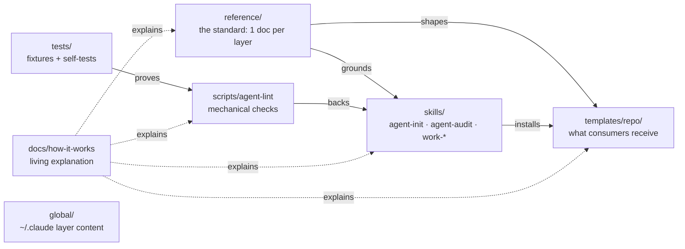
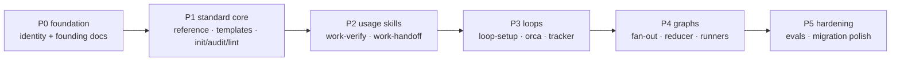
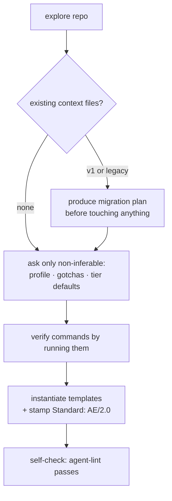
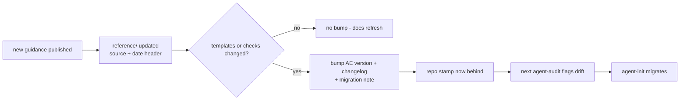
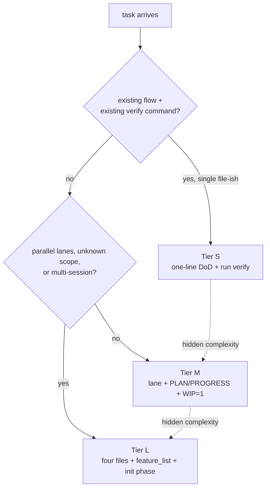
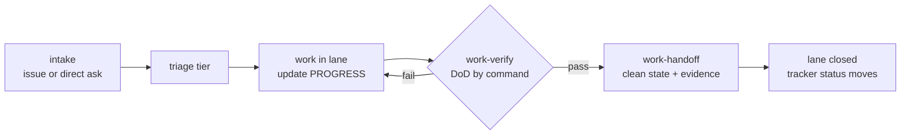
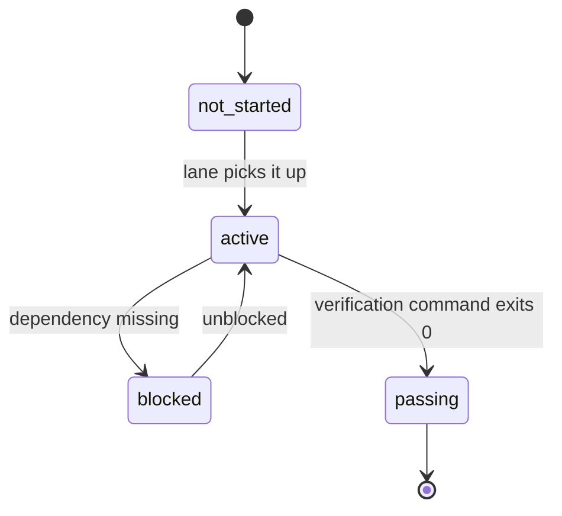

# Agent-Engineering P0 (Foundation) Implementation Plan

> **For agentic workers:** REQUIRED SUB-SKILL: Use superpowers:subagent-driven-development (recommended) or superpowers:executing-plans to implement this plan task-by-task. Steps use checkbox (`- [ ]`) syntax for tracking.

**Goal:** Create the `Agent-Engineering` repo from scratch — fresh git history, root identity
files, founding docs (spec + how-it-works chapters with diagrams), public GitHub repo with
house conventions — leaving the old repo and all skill junctions untouched.

**Architecture:** Docs-and-infrastructure phase, no code. A fresh `git init` at
`C:\Briar\repos\mine\Agent-Engineering`; only root files plus `docs/` are created
(directories materialize in the phase that owns them — no empty scaffolding). The repo
applies the standard to itself from commit one: canonical `AGENTS.md` (≤60 lines) +
one-line pointer `CLAUDE.md`.

**Tech Stack:** git, GitHub CLI (`gh`), Markdown with Mermaid diagrams, PowerShell on
Windows.

**Spec:** `docs/specs/SPEC-agent-engineering.md` (in Context-Engineering on branch
`spec/agent-engineering` until Task 3 ports it into the new repo).

## Global Constraints

- All file content in technical English (house rule).
- **Zero references to `Context-Engineering` in any new-repo file content** (spec non-goal).
  Porting FROM its local path is fine; naming it in content is not.
- `AGENTS.md` ≤60 lines; `CLAUDE.md` ≤3 lines; both counted with `Measure-Object -Line`.
- `docs/how-it-works/` is exempt from length budgets — rich prose + Mermaid encouraged.
- Every chapter marks not-yet-built behavior with its phase tag (e.g. "(arrives P1)") so the
  docs never claim unbuilt things exist.
- New-repo P0 commits go directly on `main` as founding commits (authorized by plan
  approval; branch+PR discipline starts in P1).
- Every commit ends with the two trailers:
  `Co-Authored-By: Claude Fable 5 <noreply@anthropic.com>` and
  `Claude-Session: https://claude.ai/code/session_01253fTnEmyEpdHv2B5XPEHM`.
- Old-repo absolute path for ports: `C:\Briar\repos\mine\Context-Engineering`.
  New-repo absolute path: `C:\Briar\repos\mine\Agent-Engineering`.
- Do NOT touch: `~/.claude/skills` junctions, the old repo's content, GitHub's old repo.

---

### Task 1: Repo init + identity files (AGENTS.md, CLAUDE.md, README, CHANGELOG)

**Files:**
- Create: `C:\Briar\repos\mine\Agent-Engineering\` (git init)
- Create: `AGENTS.md`, `CLAUDE.md`, `README.md`, `CHANGELOG.md`

**Interfaces:**
- Consumes: nothing (first task).
- Produces: the repo root every later task writes into; `AGENTS.md` hard constraints that
  Tasks 4–6 must obey (how-it-works update rule).

- [ ] **Step 1: Initialize the repo**

```powershell
New-Item -ItemType Directory -Force C:\Briar\repos\mine\Agent-Engineering | Out-Null
Set-Location C:\Briar\repos\mine\Agent-Engineering
git init -b main
```

Expected: `Initialized empty Git repository`.

- [ ] **Step 2: Write `AGENTS.md`** (canonical entry; this exact content)

```markdown
# Agent-Engineering

Standard: AE/2.0

Source of truth for the agent-engineering standard — six layers (context,
memory, harness, loop, graph, with reducer/MCP cross-cutting) — and the
tooling that replicates it. The standard is runtime-neutral: any agent that
reads files can follow it.

## Commands

- No build/test tooling yet. `agent-lint` and its self-tests arrive in P1;
  until then verification is manual review against
  `docs/specs/SPEC-agent-engineering.md`.

## Hard constraints

- Any change that alters structure or behavior updates the affected
  `docs/how-it-works/` chapter in the same change; without that, the change
  is not complete.
- Every skill ships with ≥3 evals, written before the skill content.
- Nothing in this repo may violate the standard it defines.
- Length budgets apply to context files (this file ≤60 lines, CLAUDE.md ≤3),
  never to `docs/how-it-works/`.

## Map

- Phase ladder and every fixed decision: `docs/specs/SPEC-agent-engineering.md`
- How the whole repo works, with diagrams: `docs/how-it-works/`
- The standard itself: `reference/` (P1)
- What consumers receive: `templates/repo/` (P1)
- Replication and daily-use skills: `skills/` (P1+)
- Mechanical checks: `scripts/` (P1)

## Status

P0 — foundation. Directories above marked (P1)/(P1+) do not exist yet;
they materialize in the phase that owns them.
```

- [ ] **Step 3: Write `CLAUDE.md`** (pointer; this exact content, one line)

```markdown
@AGENTS.md
```

- [ ] **Step 4: Write `README.md`** (this exact content)

```markdown
# Agent-Engineering

The agent-engineering standard: one repo that defines, installs, and audits
how AI-agent work happens across all of my repositories — six layers,
runtime-neutral, model-agnostic.

| Layer | Question it answers |
|---|---|
| Context | what does the model see right now? |
| Memory | what survives between sessions? |
| Harness | what surrounds one run — tools, state, permissions, verification? |
| Loop | how does work repeat itself with feedback and a stop rule? |
| Graph | how do many loops coordinate — lanes, gates, reducers? |
| Cross-cutting | reducers between fan-out and synthesis; MCP as the tool standard |

## Architecture

Each directory answers exactly one question:

| Directory | Question | Status |
|---|---|---|
| `reference/` | what is the standard, and why? | P1 |
| `templates/repo/` | what gets installed in a consuming repo? | P1 |
| `skills/` | how does it replicate and get used day to day? | P1+ |
| `scripts/` | what is checked mechanically, without judgment? | P1 |
| `global/` | what belongs in the global (`~/.claude`) layer? | P1 |
| `tests/` | how is the standard itself tested? | P1 |
| `docs/` | why did we decide this, and how does it all work? | live |

Deep dive: **`docs/how-it-works/`** — the living self-documentation of this
repo, updated as part of every change.

## The standard in one paragraph

A consuming repo carries a canonical `AGENTS.md` of ≤60 lines (what the repo
is, verified commands, real gotchas, genuine hard constraints, a version
stamp) plus a pointer `CLAUDE.md`, and a `docs/` tree of decision records
and rich-reference specs. Work above trivial size runs under explicit
ceremony scaled by tier (S/M/L): definition of done written first, one lane
of work in progress at a time, verification by command — never by
confidence — and clean-state handoffs. Everything an agent needs lives in
files, so any model or runtime can pick up any lane.

## Status

Phase **P0 — foundation**. The phase ladder (P0 → P5), every fixed decision,
and acceptance criteria live in `docs/specs/SPEC-agent-engineering.md`.

## License

MIT — see `LICENSE`.
```

- [ ] **Step 5: Write `CHANGELOG.md`** (this exact content)

```markdown
# Changelog

Versions of the standard (`AE/<major>.<minor>`). Template or check changes
bump the version; docs-only refreshes do not.

## [Unreleased] — AE/2.0

- P0 foundation: repo identity, founding spec, `docs/how-it-works/` chapters.
```

- [ ] **Step 6: Verify budgets and content rules**

```powershell
(Get-Content AGENTS.md | Measure-Object -Line).Lines   # expect ≤ 60
(Get-Content CLAUDE.md | Measure-Object -Line).Lines   # expect ≤ 3
Select-String -Path AGENTS.md,CLAUDE.md,README.md,CHANGELOG.md -Pattern 'Context-Engineering'
```

Expected: line counts within budget; the Select-String returns nothing.

- [ ] **Step 7: Commit**

```powershell
git add AGENTS.md CLAUDE.md README.md CHANGELOG.md
git commit -m "feat: repo identity - canonical AGENTS.md, pointer CLAUDE.md, README, changelog"
```

(Trailers per Global Constraints on every commit; omitted from snippets for brevity.)

---

### Task 2: Community files (LICENSE, SECURITY, .github) — no CODE_OF_CONDUCT

**Files:**
- Create: `LICENSE` (ported), `SECURITY.md` (ported + adapted)
- Create: `.github/PULL_REQUEST_TEMPLATE.md`,
  `.github/ISSUE_TEMPLATE/bug_report.md`, `.github/ISSUE_TEMPLATE/feature_request.md`

**Interfaces:**
- Consumes: repo root from Task 1.
- Produces: the community surface GitHub renders; nothing later depends on it.

- [ ] **Step 1: Port LICENSE verbatim**

```powershell
Copy-Item C:\Briar\repos\mine\Context-Engineering\LICENSE C:\Briar\repos\mine\Agent-Engineering\LICENSE
```

- [ ] **Step 2: Port SECURITY.md and adapt the repo name**

Copy `C:\Briar\repos\mine\Context-Engineering\SECURITY.md`, then read it and replace any
occurrence of the old repo's name with `Agent-Engineering` (there must be zero old-name
mentions afterward). If the file is generic boilerplate with no name, copy as is.

- [ ] **Step 3: Write fresh minimal .github templates** (exact contents)

`.github/PULL_REQUEST_TEMPLATE.md`:

```markdown
## What

## Why

## Verification

- [ ] `docs/how-it-works/` updated if structure or behavior changed
- [ ] Verified by command (paste output or say what you ran)
```

`.github/ISSUE_TEMPLATE/bug_report.md`:

```markdown
---
name: Bug report
about: Something in the standard, templates, or skills is wrong
---

**What happened**

**What you expected**

**Where** (file/skill/template + version stamp of the affected repo)
```

`.github/ISSUE_TEMPLATE/feature_request.md`:

```markdown
---
name: Feature request
about: Propose a change to the standard or its tooling
---

**Problem**

**Proposal**

**Which layer** (context / memory / harness / loop / graph / cross-cutting)
```

- [ ] **Step 4: Verify no old-name leaks, then commit**

```powershell
Select-String -Path SECURITY.md,.github\PULL_REQUEST_TEMPLATE.md,.github\ISSUE_TEMPLATE\*.md -Pattern 'Context-Engineering'
git add LICENSE SECURITY.md .github
git commit -m "feat: community files - license, security policy, PR/issue templates"
```

Expected: Select-String returns nothing; commit succeeds.

---

### Task 3: Port the founding docs (spec + this plan)

**Files:**
- Create: `docs/specs/SPEC-agent-engineering.md` (byte-identical port)
- Create: `docs/plans/2026-08-16-agent-engineering-p0-foundation.md` (this plan, ported)

**Interfaces:**
- Consumes: the spec at
  `C:\Briar\repos\mine\Context-Engineering\docs\specs\SPEC-agent-engineering.md`
  (branch `spec/agent-engineering` must be checked out there before copying).
- Produces: `docs/specs/SPEC-agent-engineering.md`, the path every later phase and the
  how-it-works chapters cite.

- [ ] **Step 1: Confirm the source branch, then copy both files**

```powershell
Set-Location C:\Briar\repos\mine\Context-Engineering
git branch --show-current   # expect: spec/agent-engineering
Set-Location C:\Briar\repos\mine\Agent-Engineering
New-Item -ItemType Directory -Force docs\specs, docs\plans | Out-Null
Copy-Item C:\Briar\repos\mine\Context-Engineering\docs\specs\SPEC-agent-engineering.md docs\specs\
Copy-Item C:\Briar\repos\mine\Context-Engineering\docs\plans\2026-08-16-agent-engineering-p0-foundation.md docs\plans\
```

- [ ] **Step 2: Verify byte-identical port**

```powershell
(Get-FileHash docs\specs\SPEC-agent-engineering.md).Hash -eq (Get-FileHash C:\Briar\repos\mine\Context-Engineering\docs\specs\SPEC-agent-engineering.md).Hash
```

Expected: `True` (same for the plan file).

- [ ] **Step 3: Commit**

```powershell
git add docs
git commit -m "docs: port founding spec and P0 plan"
```

Note: the spec and this plan legitimately name the old repo (they document the
succession and the port paths). The zero-references rule applies to files *authored for*
the new repo; these two ported founding records are the sanctioned exception — no
scrubbing.

---

### Task 4: how-it-works — README (map) + architecture.md

**Files:**
- Create: `docs/how-it-works/README.md`, `docs/how-it-works/architecture.md`

**Interfaces:**
- Consumes: spec (Architecture section, Decisions 1–2, 7, 11), AGENTS.md hard constraints.
- Produces: the chapter map Tasks 5–6 extend; the phase-tag convention
  (`> Phase: …`) all chapters use.

- [ ] **Step 1: Write `docs/how-it-works/README.md`** (exact content)

```markdown
# How this repo works

Living self-documentation of Agent-Engineering: what every piece is, how the
flows run end to end, and why it is built this way. This folder is exempt
from the minimalism budget on purpose — it is just-in-time human
documentation, not always-loaded agent context. The hard rule that keeps it
honest: **any change that alters structure or behavior updates the affected
chapter in the same change.**

| Chapter | Covers | Fills in |
|---|---|---|
| [architecture.md](architecture.md) | the directory map, what each part answers, how they connect | P0 |
| [standard-lifecycle.md](standard-lifecycle.md) | install → audit → update/migrate flows, versioning | P0 (design), P1 (live) |
| [work-lifecycle.md](work-lifecycle.md) | task tiers S/M/L, lanes, the four files, feature list, tracker plane | P0 (design), P2 (live) |
| execution.md | loops, fan-out/reducer, runners, Orca mapping | arrives P3–P4 |

Convention: every section that documents behavior not yet built carries a
`> Phase: PN` note, so this folder never claims unbuilt things exist.
```

- [ ] **Step 2: Write `docs/how-it-works/architecture.md`**

Rich prose (no length cap). Required structure and content — write full paragraphs around
each bullet; include both diagrams exactly:

- `# Architecture` — intro: one repo that defines (reference), installs (templates),
  replicates (skills), enforces (scripts), and explains (docs) the standard.
- `## The map` — this diagram:

````markdown

````

- `## What each directory answers` — one subsection per directory (reference, templates,
  skills, scripts, global, tests, docs), each: the single question it answers, what lives
  inside, its phase tag, and the design rule it embodies (e.g. scripts = checks without
  judgment vs skills = judgment; templates = the only content consumers ever receive).
- `## The six layers` — prose walk of context → memory → harness → loop → graph +
  cross-cutting, one paragraph each: what the layer owns, its failure smell, which
  reference doc will define it `> Phase: P1` (P3/P4 for loops/graphs).
- `## The phase ladder` — this diagram plus a paragraph per phase citing the spec's
  acceptance criteria:

````markdown

````

- `## Design rules that bind this repo` — dogfooding gate; evals-before-content;
  budget-exempt how-it-works + the same-change update rule; no empty scaffolding
  (directories materialize with their phase); runtime-neutrality (any file-reading agent
  can follow the standard).

- [ ] **Step 3: Verify and commit**

```powershell
Select-String -Path docs\how-it-works\*.md -Pattern 'Context-Engineering'   # expect: nothing
git add docs\how-it-works
git commit -m "docs(how-it-works): chapter map and architecture"
```

---

### Task 5: how-it-works — standard-lifecycle.md

**Files:**
- Create: `docs/how-it-works/standard-lifecycle.md`

**Interfaces:**
- Consumes: spec Decisions 3–5, "The standard v2", "Versioning and updates", skill
  behavior contracts; phase-tag convention from Task 4.
- Produces: the lifecycle reference that agent-init/agent-audit implementers (P1) build
  against.

- [ ] **Step 1: Write the chapter**

Required structure; full prose per section; include all three diagrams exactly; every flow
carries `> Phase: P1` (design documented now, tooling lands in P1):

- `# The standard's lifecycle` — intro: a consuming repo passes through install → work →
  audit → update; the repo carries a greppable stamp `Standard: AE/<major>.<minor>`.
- `## What a consuming repo carries` — always: canonical AGENTS.md ≤60 lines (content list
  from the spec) + pointer CLAUDE.md (`@AGENTS.md`) + docs tree. Per task: `work/<slug>/`
  artifacts by tier (forward-link to work-lifecycle.md).
- `## Install (agent-init)` — prose + this diagram:

````markdown

````

- `## Audit (agent-audit)` — judgment review against reference/ + mechanical `agent-lint`
  subset; checks listed from the spec (stamp drift, work/ coherence, feature-list gating,
  pointer shape); dogfooding note: run on this repo it additionally checks how-it-works
  coverage and freshness.
- `## Update and migration` — this diagram + prose on the knowledge flow (new guidance →
  reference/ update with source+date → version bump only if templates/checks changed →
  consuming repos learn at next audit):

````markdown

````

- `## Versioning rules` — stamp format, semver semantics, changelog location, migration
  notes path (`skills/agent-init/references/migration.md`, P1).

- [ ] **Step 2: Verify and commit**

```powershell
Select-String -Path docs\how-it-works\standard-lifecycle.md -Pattern 'Context-Engineering'
git add docs\how-it-works\standard-lifecycle.md
git commit -m "docs(how-it-works): standard lifecycle - install, audit, update, versioning"
```

---

### Task 6: how-it-works — work-lifecycle.md

**Files:**
- Create: `docs/how-it-works/work-lifecycle.md`

**Interfaces:**
- Consumes: spec Decisions 7–8, tier table, skill contracts (work-verify, work-handoff);
  phase-tag convention from Task 4.
- Produces: the work-discipline reference that P2 skills implement.

- [ ] **Step 1: Write the chapter**

Required structure; full prose; all three diagrams exactly; sections documenting P2/P3
behavior carry their phase tags:

- `# How work runs under the standard` — intro: ceremony scales with tier; evidence over
  confidence; one lane in progress at a time (WIP=1).
- `## Tier triage` — the rule from the spec (S needs an existing flow + existing verify
  command; new flows or cross-module → M; parallel lanes / unknown scope / multi-session
  → L; when in doubt, higher) + this diagram:

````markdown

````

  Plus the ratchet paragraph: upgrades only, never downgrades mid-task.
- `## The lane and the four files` — `work/<slug>/` (slug carries the issue key when
  tracker-linked); SPEC (owner-written, agent never edits), PLAN (steps with executable
  acceptance), PROGRESS (done / in progress / tried-and-failed / next — first read of
  every session), DECISIONS (append-only choice + why). Why per-lane folders: parallel
  worktrees never collide on a root file. `> Phase: P1 templates, P2 skills`.
- `## The lane lifecycle` — this diagram + prose:

````markdown

````

- `## Verification: three layers` — static → tests + app starts → end-to-end for
  cross-component changes; maker ≠ checker (fresh-context review at M+); "done" requires
  evidence written to PROGRESS/feature list. `> Phase: P2`.
- `## Feature list (Tier L)` — the triple (behavior, verification command, state); this
  state machine; harness moves the states, never the agent's opinion; `passing` is
  irreversible:

````markdown

````

- `## The tracker plane (Linear)` — planes separation verbatim from spec Decision 8:
  workflow state lives in the tracker, verification state in the repo; issue → Done only
  when repo says `passing`; direction rules (intent flows tracker→repo, execution truth
  repo→tracker); optional (`issue:` field and key-in-slug are affordances, never
  requirements). `> Phase: P3 (tracker.md + connector recipes)`.

- [ ] **Step 2: Verify and commit**

```powershell
Select-String -Path docs\how-it-works\work-lifecycle.md -Pattern 'Context-Engineering'
git add docs\how-it-works\work-lifecycle.md
git commit -m "docs(how-it-works): work lifecycle - tiers, lanes, verification, tracker plane"
```

---

### Task 7: GitHub repo creation + house conventions + push

**Files:**
- Modify: none (remote operations on the repo from Tasks 1–6)

**Interfaces:**
- Consumes: the complete local repo.
- Produces: `https://github.com/bygama/Agent-Engineering` (public), the remote every later
  phase pushes to.

- [ ] **Step 1: Create the public repo and push**

```powershell
Set-Location C:\Briar\repos\mine\Agent-Engineering
gh repo create bygama/Agent-Engineering --public --source . --push --description "The agent-engineering standard: context, memory, harness, loop, graph - runtime-neutral, model-agnostic."
```

Expected: repo created, `main` pushed.

- [ ] **Step 2: Apply house conventions (rebase-only merges, auto-delete branches)**

```powershell
gh repo edit bygama/Agent-Engineering --enable-rebase-merge=true --enable-merge-commit=false --enable-squash-merge=false --delete-branch-on-merge
```

- [ ] **Step 3: Verify conventions and visibility**

```powershell
gh repo view bygama/Agent-Engineering --json visibility,rebaseMergeAllowed,mergeCommitAllowed,squashMergeAllowed,deleteBranchOnMerge
```

Expected JSON: `visibility PUBLIC`, `rebaseMergeAllowed true`, `mergeCommitAllowed false`,
`squashMergeAllowed false`, `deleteBranchOnMerge true`.

---

### Task 8: Memories + P0 acceptance check

**Files:**
- Create: `C:\Users\mateo\.claude\projects\C--Briar-repos-mine\memory\agent-engineering-repo.md`
- Modify: `C:\Users\mateo\.claude\projects\C--Briar-repos-mine\memory\context-engineering-repo-status.md`
- Modify: `C:\Users\mateo\.claude\projects\C--Briar-repos-mine\memory\MEMORY.md`

**Interfaces:**
- Consumes: everything above.
- Produces: session-persistent knowledge of the new repo; the P0 acceptance verdict.

- [ ] **Step 1: Write the new memory** (frontmatter `type: project`; body: repo path +
  GitHub URL, phase status "P0 done, next P1 per
  `docs/plans/2026-08-16-agent-engineering-p0-foundation.md` and the spec", the
  same-change how-it-works rule, link `[[context-engineering-repo-status]]`)

- [ ] **Step 2: Update the old repo's memory** — append: evolving into Agent-Engineering;
  skills still junction-linked from its local clone until P1 swap; **GitHub repo will be
  deleted at P1 exit with mateo's explicit confirmation**; do not invest in it further.
  Update the MEMORY.md index lines for both memories.

- [ ] **Step 3: Run the P0 acceptance checklist (spec)**

```powershell
gh repo view bygama/Agent-Engineering --json visibility --jq .visibility        # PUBLIC
Get-ChildItem C:\Briar\repos\mine\Agent-Engineering -Recurse -File | Measure-Object   # 14 files (+.git)
Get-Item ~\.claude\skills\context-init, ~\.claude\skills\context-audit | Select-Object FullName,LinkType,Target  # junctions intact -> old clone
```

Expected: PUBLIC; files = the 15 authored in Tasks 1–6 (4 identity + 5 community + 2
founding docs + 4 how-it-works); junctions unchanged (LinkType Junction, targets under the
old clone's `skills\`). If any check fails, fix before declaring P0 done.

- [ ] **Step 4: Report** — P0 complete: repo URL, file list, acceptance results, and the
  P1 reminder (junction swap + deletion ritual live there).
